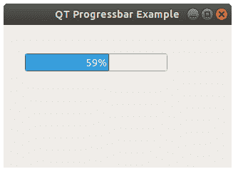

# 进度条

> 原文： [https://pythonbasics.org/Progressbar/](https://pythonbasics.org/Progressbar/)

`QProgressBar`是显示过程的小部件。 您可能在安装过​​程中多次看到它。

小部件显示一个条，您可以看到完成的百分比。 您可以使用方法`setValue()`设置其值。 如果将 50 设置为 50%。


## `QProgressBar`

### 进度条

使用下面的代码创建进度条：

```py
self.pbar = QProgressBar(self)
self.pbar.setGeometry(30, 40, 200, 25)

```

您可以使用以下方法设置值：

```py
self.pbar.setValue(50)

```

这就是创建进度条所需的全部。

要更新其值，您可以使用`QTimer`。

```py
from PyQt5.QtCore import QBasicTimer

```

每秒用以下几行调用一个方法：

```py
self.timer = QTimer()        self.timer.timeout.connect(self.handleTimer)
self.timer.start(1000)

```

然后更新进度条值：

```py
def handleTimer(self):
    value = self.pbar.value()
    if value < 100:
        value = value + 1
        self.pbar.setValue(value)
    else:
        self.timer.stop()

```



### 示例

复制下面的代码以查看进度条从 50% 到 100% 的计数。使用`handleTimer()`和`QTimer()`方法更新进度条。

```py
import sys
from PyQt5.QtCore import QTimer
from PyQt5.QtWidgets import QApplication, QMainWindow, QProgressBar
from PyQt5.QtCore import Qt

class Example(QMainWindow):

    def __init__(self):
        super().__init__()

        self.pbar = QProgressBar(self)
        self.pbar.setGeometry(30, 40, 200, 25)
        self.pbar.setValue(50)

        self.setWindowTitle("QT Progressbar Example")
        self.setGeometry(32,32,320,200)
        self.show()

        self.timer = QTimer()
        self.timer.timeout.connect(self.handleTimer)
        self.timer.start(1000)

    def handleTimer(self):
        value = self.pbar.value()
        if value < 100:
            value = value + 1
            self.pbar.setValue(value)
        else:
            self.timer.stop()

if __name__ == '__main__':
    app = QApplication(sys.argv)
    ex = Example()
    sys.exit(app.exec_())

```

[下载示例](https://gum.co/pysqtsamples)