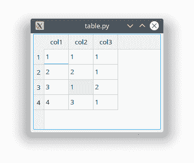

# PyQt 表格

> 原文： [https://pythonbasics.org/pyqt-table/](https://pythonbasics.org/pyqt-table/)

可以使用`QTableWidget`创建表。 它是基于项目的表视图，类似于您在 Excel 中看到的视图。

您可以将表格窗口小部件作为 gui 的一部分，或弹出带有表格之类的 Excel 的窗口。

在此示例（**PyQt5**）中，它将显示带有表的窗口，但是您可以通过 Designer 将其作为窗口 GUI 的一部分。


## 表格

### `QTableWidget`

`QTableWidget`是具有行和列的表小部件。

该对象具有方法`.setRowCount(x)`和`.setColumnCount(y)`，其中`x`是行数，`y`是列数。 您可以将其用作`self.setRowCount(5)`。



内容由`self.setItem(m, n, newitem)`设置，其中`m`和`n`是表格内的坐标。

变量`newitem`的类型为`QTableWidgetItem`，可以将文本值作为字符串。 例如：`.setItem(1,2, QTableWidgetItem("Table Cell"))`


### PyQT 中的表格

该表由变量数据定义。

```py
data = {'col1':['1','2','3','4'],
        'col2':['1','2','1','3'],
        'col3':['1','1','2','1']}

```

下面的示例创建一个包含 3 列和若干行的表。

```py

from PyQt5.QtWidgets import QMainWindow, QApplication, QWidget, QAction, QTableWidget,QTableWidgetItem,QVBoxLayout
from PyQt5.QtGui import QIcon
from PyQt5.QtCore import pyqtSlot
import sys

data = {'col1':['1','2','3','4'],
        'col2':['1','2','1','3'],
        'col3':['1','1','2','1']}

class TableView(QTableWidget):
    def __init__(self, data, *args):
        QTableWidget.__init__(self, *args)
        self.data = data
        self.setData()
        self.resizeColumnsToContents()
        self.resizeRowsToContents()

    def setData(self): 
        horHeaders = []
        for n, key in enumerate(sorted(self.data.keys())):
            horHeaders.append(key)
            for m, item in enumerate(self.data[key]):
                newitem = QTableWidgetItem(item)
                self.setItem(m, n, newitem)
        self.setHorizontalHeaderLabels(horHeaders)

def main(args):
    app = QApplication(args)
    table = TableView(data, 4, 3)
    table.show()
    sys.exit(app.exec_())

if __name__=="__main__":
    main(sys.argv)

```

[下载示例](https://gum.co/pysqtsamples)