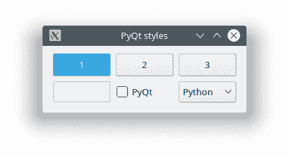
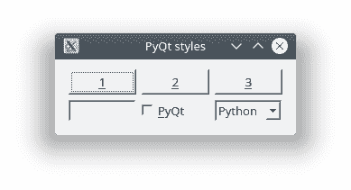

# PyQt 样式

> 原文： [https://pythonbasics.org/pyqt-style/](https://pythonbasics.org/pyqt-style/)

可以配置 PyQt 样式。 PyQt 的默认样式称为“融合”。 但这不是唯一的样式。 您可能需要在多个操作系统上分发您的应用程序，并具有本机外观。

如果您使用 Windows，则可能需要 Windows 外观。 在 Mac 上，您可能需要 Mac OS X 样式。 所有这些都可以配置。 Mac 样式仅在 Mac OS X 上可用。


## PyQt 样式

### 可用样式

可用样式可能因系统而异。 您可以使用 Python 解释器获取可用样式的列表，如下所示：

```py
$ python3
Python 3.6.7 (default, Oct 22 2018, 11:32:17) 
[GCC 8.2.0] on linux
Type "help", "copyright", "credits" or "license" for more information.
>>> import PyQt5.QtWidgets
>>> print(PyQt5.QtWidgets.QStyleFactory.keys())
['Breeze', 'Oxygen', 'QtCurve', 'Windows', 'Fusion']

```

微风风格如下：



### 配置样式

您可以使用`app.setStyle('Fusion')`行设置样式。

像这样：

```py
app = QApplication([])
app.setStyle('Windows')

```

然后窗口显示如下（旧的 Win 9x 样式）：



[下载示例](https://gum.co/pysqtsamples)