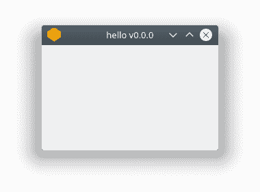

# 编译 PyQt 到 EXE

> 原文： [https://pythonbasics.org/Compile-PyQt-to-exe/](https://pythonbasics.org/Compile-PyQt-to-exe/)

要分发您的应用程序，您需要有一个可执行程序而不是源代码。 这比给用户提供许多 Python 文件要容易。

为什么？ 用户只需单击一下即可启动您的应用程序。 在 Windows 上，它是`.exe`。 在 Mac OS X 上，它是`.dmg`


## 构建 EXE

### 安装工具链

您可以使用`fbs`创建可以运行的程序。

```py
sudo apt3 install python3-venv
python3 -m venv venv
source bin/activate
pip3 install fbs PyQt5==5.9.2 PyInstaller==3.4
fbs startproject

```

然后，系统会要求您输入应用程序的名称和作者

```py
App name [MyApp] : hello
Author [Linux] : boss
Mac bundle identifier (eg. com.boss.hello, optional): 

Created the src/ directory. 

```

看一下文件`/venv/src/main/python/main.py`。 这就是您的程序的源代码。

键入`fbs run`启动程序。



### 创建可执行文件

您从二进制文件启动应用程序。 在 Windows 上是`.exe`，在 Mac 上是`.dmg`

制作独立的可执行文件类型

`fbs freeze`。

然后在`target/`中创建程序。 如果您将应用命名为`hello`，则为`target/hello/hello`。

### 设置

始终使用安装程序来安装软件。 您可以使用命令`fbs installer`创建自己的安装程序。

在 Windows 和 Mac 上，这将创建一个图形安装程序（安装向导）。

在 Linux 上，它会创建一个软件包文件（`.deb`，`.rpm`），可以与软件包管理器一起安装。

[下载示例](https://gum.co/pysqtsamples)