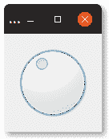

# `QDial`

> 原文： [https://pythonbasics.org/QDial/](https://pythonbasics.org/QDial/)

PyQT 中包含一个拨号小部件（`QDial`）。它看起来像是您经常在混合面板上看到的音量控件。 它是`PyQt5.QtWidgets`的一部分。



`QDial`小部件的外观可能会在操作系统上发生变化。 但是逻辑在所有平台上都是相同的。


## `QDial`

### 拨号小部件示例

它具有最小值和最大值，可以使用方法`setMinimum()`和`setMaximum()`进行设置。

您可以使用`setValue()`设置默认值。 如果更改了值，则可以调用方法（`.valueChanged.connect(self.sliderMoved)`）。

当前值为`.value()`。

### 示例

下面的示例创建一个拨号小部件窗口。 您可以复制并粘贴程序进行测试。 必须安装 PyQt5 才能运行该程序。

```py
from PyQt5.QtWidgets import *
import sys

class Window(QWidget):
    def __init__(self):
        QWidget.__init__(self)
        layout = QGridLayout()
        self.setLayout(layout)
        self.dial = QDial()
        self.dial.setMinimum(0)
        self.dial.setMaximum(100)
        self.dial.setValue(40)
        self.dial.valueChanged.connect(self.sliderMoved)
        layout.addWidget(self.dial)

    def sliderMoved(self):
        print("Dial value = %i" % (self.dial.value()))

app = QApplication(sys.argv)
screen = Window()
screen.show()
sys.exit(app.exec_())

```

[下载示例](https://gum.co/pysqtsamples)