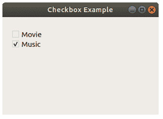

# `QCheckBox`

> 原文： [https://pythonbasics.org/qcheckbox/](https://pythonbasics.org/qcheckbox/)

复选框（`QCheckbox`）是默认的 QT 小部件，可以使用方法`setChecked(true)`进行检查。 它是`PyQt5.QtWidgets`的一部分。

您可以使用`.toggled.connect()`添加点击回调/信号。 然后，接收槽可以处理事件。




## `QCheckBox`

### PyQt 复选框示例

下面的示例在 PyQt 窗口中创建一个复选框。 如果单击复选框，它将调用方法`onClicked()`。 方法`.isChecked()`可用于获取复选框状态。

```py
from PyQt5.QtWidgets import *
import sys

class Window(QWidget):
    def __init__(self):
        QWidget.__init__(self)
        layout = QGridLayout()
        self.setLayout(layout)

        radiobutton = QCheckBox("I have a Cat")
        radiobutton.setChecked(True)
        radiobutton.animal = "Cat"
        radiobutton.toggled.connect(self.onClicked)
        layout.addWidget(radiobutton, 0, 0)

    def onClicked(self):
        radioButton = self.sender()
        print("Animal " + (radioButton.animal) + " is " + str(radioButton.isChecked()))

app = QApplication(sys.argv)
screen = Window()
screen.show()
sys.exit(app.exec_())

```

[下载示例](https://gum.co/pysqtsamples)