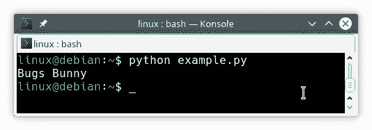

# 字符串连接

> 原文： [https://pythonbasics.org/join/](https://pythonbasics.org/join/)

`join(sequence)`方法连接元素并返回组合的字符串。 连接方法组合序列的每个元素。

合并单词列表？

使用`join(sequence)`方法将它们组合成一个句子。 在分隔符字符串上调用该方法，该字符串可以是任何字符，从空格到破折号。

这比对每个单词使用加号运算符要容易，因为每个单词的列表很快就会变得很乏味。


## 示例

`join`方法将序列作为参数。 序列被写为单个参数：您需要在序列周围添加方括号。

如果需要，您可以传递一个将序列作为参数的变量。 这使其更易于阅读。 在下面的示例中，我们将使用空格分隔符字符串。

请尝试以下程序：

```py
# define strings                                                         
firstname = "Bugs"
lastname = "Bunny"

# define our sequence                                                    
sequence = (firstname,lastname)

# join into new string                                                   
name = " ".join(sequence)
print(name)

```

您应该看到以下输出：



它还可以加入单词列表：

```py
words = ["How","are","you","doing","?"]
sentence = ' '.join(words)
print(sentence)

```

## 练习

试试下面的练习

1.  像上面的示例一样，创建单词列表并将其连接起来。
2.  尝试将分隔符字符串从空格更改为下划线。

[下载示例](https://gum.co/dcsp)