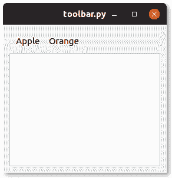

# PyQt 工具栏

> 原文： [https://pythonbasics.org/pyqt-Toolbar/](https://pythonbasics.org/pyqt-Toolbar/)

PyQt 窗口除了文件菜单外，通常还具有工具栏`QToolBar`。 工具栏包含一些按钮。 在网络浏览器中，这些按钮可以是后退，前进，刷新，主页。 在文本编辑器中，打开，保存等等。



在本文中，您将学习如何在窗口中添加工具栏。


## 工具栏

### `QToolBar`示例

下面的程序创建一个带有工具栏`QToolBar`和按钮`QToolButton`的窗口。 您可以将工具栏添加到任何 PyQt 窗口。 它还添加了文本框。

工具栏添加到布局`QGridLayout`，按钮`QToolButton`添加到`QToolBar`。

```py
from PyQt5.QtWidgets import *
import sys

class Window(QWidget):

    def __init__(self):
        QWidget.__init__(self)
        layout = QGridLayout()
        self.setLayout(layout)

        # Create pyqt toolbar
        toolBar = QToolBar()
        layout.addWidget(toolBar)

        # Add buttons to toolbar
        toolButton = QToolButton()
        toolButton.setText("Apple")
        toolButton.setCheckable(True)
        toolButton.setAutoExclusive(True)
        toolBar.addWidget(toolButton)
        toolButton = QToolButton()
        toolButton.setText("Orange")
        toolButton.setCheckable(True)
        toolButton.setAutoExclusive(True)
        toolBar.addWidget(toolButton)

        # Add textfield to window
        tbox = QPlainTextEdit()
        layout.addWidget(tbox)

app = QApplication(sys.argv)
screen = Window()
screen.show()
sys.exit(app.exec_())

```