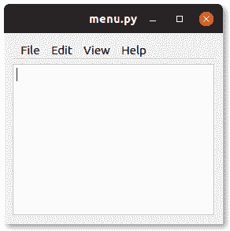

# PyQt 菜单栏

> 原文： [https://pythonbasics.org/pyqt-menubar/](https://pythonbasics.org/pyqt-menubar/)

菜单栏可以添加到 PyQt 窗口中。 它是带有按钮项的水平条，通常是文件菜单等。

本示例向 PyQt 窗口添加菜单栏和文本框。 如下面的屏幕截图所示。




## PyQt 菜单栏

### 菜单栏示例

可以使用`QMenuBar()`来构建菜单栏。 您可以像这样添加菜单`.addMenu("File")`。 然后将操作添加到菜单，使`.addAction("Open")`成为可能。

菜单栏必须添加到布局中，可通过此行`layout.addWidget(menubar, 0, 0)`完成。

```py
from PyQt5.QtCore import *
from PyQt5.QtWidgets import *
import sys

class Window(QWidget):
    def __init__(self):
        QWidget.__init__(self)
        layout = QGridLayout()
        self.setLayout(layout)

        # create menu
        menubar = QMenuBar()
        layout.addWidget(menubar, 0, 0)
        actionFile = menubar.addMenu("File")
        actionFile.addAction("New")
        actionFile.addAction("Open")
        actionFile.addAction("Save")
        actionFile.addSeparator()
        actionFile.addAction("Quit")
        menubar.addMenu("Edit")
        menubar.addMenu("View")
        menubar.addMenu("Help")

        # add textbox
        tbox = QPlainTextEdit()
        layout.addWidget(tbox, 1, 0)

app = QApplication(sys.argv)
screen = Window()
screen.show()
sys.exit(app.exec_())

```

[下载示例](https://gum.co/pysqtsamples)