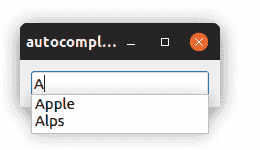

# PyQt 自动补全

> 原文： [https://pythonbasics.org/pyqt-auto-complete/](https://pythonbasics.org/pyqt-auto-complete/)

PyQt 支持自动补全。 如果输入文本框（`QLineEdit`），它可以提出建议。 从列表中推荐这些建议。

本示例将自动补全功能添加到`QLineEdit`文本框中。



图片：在 PyQt 窗口中显示的标签。

## 自动补全

### `QLineEdit`自动补全示例

首先创建选项（名称）列表，然后创建`completer = QCompleter(names)`。

使用行`self.lineedit = QLineEdit()`创建行编辑。 否则，行编辑将正常进行。

这些建议已添加到`self.lineedit.setCompleter(completer)`中。

如果忘记了最后一行，则`QCompleter`和`QLineEdit`未连接，这意味着没有**自动补全**。

```py
from PyQt5.QtWidgets import *
import sys

class Window(QWidget):
    def __init__(self):
        QWidget.__init__(self)
        layout = QGridLayout()
        self.setLayout(layout)

        # auto complete options                                                 
        names = ["Apple", "Alps", "Berry", "Cherry" ]
        completer = QCompleter(names)

        # create line edit and add auto complete                                
        self.lineedit = QLineEdit()
        self.lineedit.setCompleter(completer)
        layout.addWidget(self.lineedit, 0, 0)

app = QApplication(sys.argv)
screen = Window()
screen.show()
sys.exit(app.exec_())

```