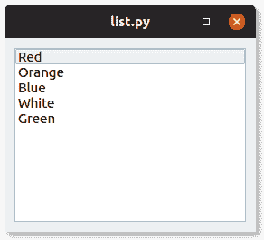

# PyQt 列表框

> 原文： [https://pythonbasics.org/pyqt-list-box/](https://pythonbasics.org/pyqt-list-box/)

列表框（`QListWidget`）提供了多个选项。 您可以单击一个项目。 想一想歌曲播放列表。 与组合框不同，它显示所有可能的选项。

下面的屏幕截图在一个窗口中显示了一个 PyQt 列表框。




## PyQt 列表框示例

### `QListWidget`

使用`QListWidget()`创建一个列表框小部件。 然后添加带有`self.listwidget.insertItem(0, "Red")`的项目，其中第一个参数是索引。

点击事件会添加点击的方法`self.listwidget.clicked.connect(self.clicked)`

```py
from PyQt5.QtWidgets import *
import sys

class Window(QWidget):
    def __init__(self):
        QWidget.__init__(self)
        layout = QGridLayout()
        self.setLayout(layout)
        self.listwidget = QListWidget()
        self.listwidget.insertItem(0, "Red")
        self.listwidget.insertItem(1, "Orange")
        self.listwidget.insertItem(2, "Blue")
        self.listwidget.insertItem(3, "White")
        self.listwidget.insertItem(4, "Green")
        self.listwidget.clicked.connect(self.clicked)
        layout.addWidget(self.listwidget)

    def clicked(self, qmodelindex):
        item = self.listwidget.currentItem()
        print(item.text())

app = QApplication(sys.argv)
screen = Window()
screen.show()
sys.exit(app.exec_())

```

[下载示例](https://gum.co/pysqtsamples)