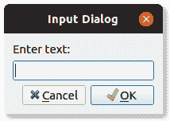

# PyQt 输入对话框

> 原文： [https://pythonbasics.org/pyqt-input-dialog/](https://pythonbasics.org/pyqt-input-dialog/)

开箱即用地支持 PyQt 中的输入对话框（`QInputDialog`）。 它具有输入文本，确定和取消按钮。

在本文中，您将看到它在 PyQt 中有效。 如屏幕截图所示




## 输入对话框

### 示例

下面的代码创建一个 PyQt 输入对话框。 单击按钮后，您可以输入一些文本。 文本显示为标签。

该对话框是使用`showDialog`方法创建的，仅几行。 输入方言是`PyQt5.QtWidgets`的一部分。

```py
from PyQt5.QtWidgets import (QWidget, QPushButton, QLineEdit, QInputDialog, QApplication, QLabel)
import sys

class Example(QWidget):

    def __init__(self):
        super().__init__()
        self.initUI()

    def initUI(self):
        # Add button                                                                                                     
        self.btn = QPushButton('Show Input Dialog', self)
        self.btn.move(30, 20)
        self.btn.clicked.connect(self.showDialog)

	# Add label                                                                                                      
        self.le = QLabel(self)
	self.le.move(30, 62)
        self.le.resize(400,22)

        self.setGeometry(300, 300, 290, 150)
	self.setWindowTitle('Input dialog')
        self.show()

    def showDialog(self):
	text, ok = QInputDialog.getText(self, 'Input Dialog', 'Enter text:')
	if ok:
            self.le.setText(str(text))

if __name__ == '__main__':
    app = QApplication(sys.argv)
    ex = Example()
    sys.exit(app.exec_())

```