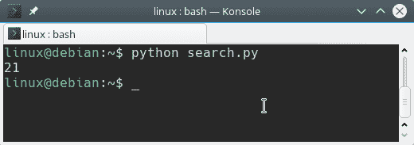

# 字符串查找

> 原文： [https://pythonbasics.org/string-find/](https://pythonbasics.org/string-find/)

`find(query)`方法内置于标准 python。 只需在字符串对象上调用方法以搜索字符串，例如：`obj.find("search")`。

`find()`方法搜索查询字符串并返回找到的字符位置。 如果找不到该字符串，则返回 -1。

用简单的英语来说：找出一个字符串是否包含另一个字符串。


## 示例

### 查找方法

如果找到一个单词，find 方法将返回索引。 如果找不到，则返回 -1。 您可以添加开始索引和结束索引：`find(query, start, end)`，但是这些参数是可选的。

请尝试以下程序：

```py
s = "That I ever did see. Dusty as the handle on the door"

index = s.find("Dusty")
print(index)

```

将程序另存为`search.py​​`，可从终端或 IDE 运行。
您应该看到以下输出：



### `in`关键字

您也可以使用关键字`in`。 下面的示例向您展示如何使用 Python `in`关键字。

```py
s = "That I ever did see. Dusty as the handle on the door"

if "Dusty" in s:
    print("query found")

```

区别在于`in`关键字如果字符串包含单词则返回，而`find`返回字符位置。

## 练习

试试下面的练习

1.  找出字符串查找是否区分大小写
2.  如果查询字符串在字符串中出现两次，该怎么办？
3.  编写一个要求控制台输入并搜索查询的程序。

[下载示例](https://gum.co/dcsp)