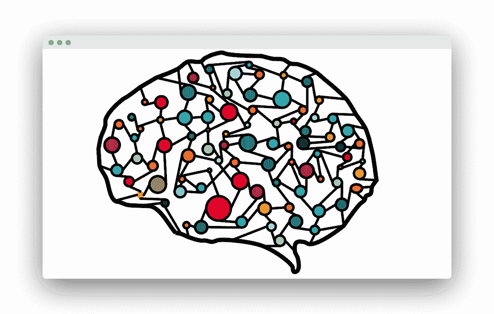

# 区分机器学习，深度学习和 AI？

> 原文： [https://pythonbasics.org/difference-machine-learning-deep-learning-ai/](https://pythonbasics.org/difference-machine-learning-deep-learning-ai/)

人工智能，机器学习和深度学习之间有什么区别？

**人工智能（AI）**，**机器学习**和**深度学习**是流行的术语。

但是名字叫什么？

这些短语混合起来就好像它们是可互换的，因为它们都围绕着几种使用数据解释来解决问题的技术。

这些术语背后的关键概念非常不同。 这是对这些技术的一般描述。

## 人工智能

**人工智能**是指机器执行复杂任务的能力，这是一个通用术语。 通常，这些是基于能够进行认知计算的算法的软件。

这包括机器人技术，自然语言处理，机器学习和深度学习。

计算能力的指数级增长已导致 AI 应用程序的爆炸式增长。您现在在科幻小说中看到的东西已经成为日常生活的一部分。

机器现在可以执行复杂的任务，而无需人工干预。这种最著名的两种形式是**机器学习**和**深度学习**。

## 机器学习

**机器学习**的思想可以追溯到 1950 年代后期。 他从斯坦福大学的一位计算机科学家开始，他认为：机器可以自己学习，而不是由人类教计算机。

学习过程需要数据，并且在线生成了大量数据，这才开始。

机器学习由可分析数据并从中学习的算法组成。这些算法使软件能够进行预测和关联。

这不同于传统编程，在传统编程中，软件依赖于手动编码的软件例程。

**真实世界示例**：为防止欺诈，机器学习有助于识别模式，行为和风险趋势并对之做出反应。 它使用训练数据来这样做。

## 深度学习

深度学习是指一类特定的机器学习和人工智能。深度学习基于**神经网络**。

神经网络创建于 1950 年代，其灵感来自人脑生物学模型。

如果我们说机器学习是人工智能的一个分支，那么深度学习就是机器学习的一个分支。

**深度学习**是一组机器学习算法，它们使用能够从经验中学习的复杂神经网络。 这些系统必须根据现有示例进行训练。

它如何工作？

在神经网络中，人工神经元被分为几层。 信息是单向流动的。 一层中的每个神经元都与其余的神经元进行通信，直到到达网络的尽头。 结果是深度学习能够使用大量数据为复杂的决策提供计算机系统。