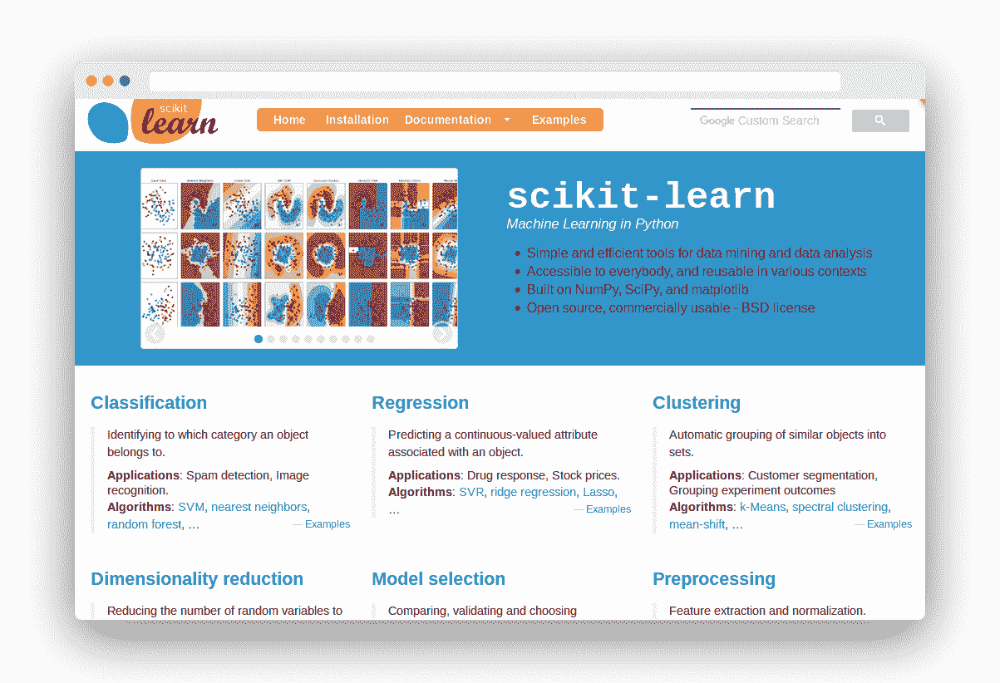

# 为什么要使用 Scikit-Learn？

> 原文： [https://pythonbasics.org/why-use-scikit-learn/](https://pythonbasics.org/why-use-scikit-learn/)

为什么要使用 Scikit-learn 进行机器学习？

在讨论“为什么要被用作或推荐为 python 编程语言的最佳免费软件机器学习库之前，我们对 scikit-learn（**sklearn**）了解甚少，这一点很重要。

## Scikit-Learn

### 什么是 Scikit-Learn

Sсіkіt-lеаrn（**sklearn**）是一种免费使用的机器学习模块。 这是用于数据分析和机器学习的简有效的工具。 因为它在 BSD 协议下发布，所以无论是出于商业目的还是出于商业目的，都可以使用它。

在 scikit-learn 中，用户可以执行不同类别的多种任务，例如模型选择，聚类，预处理和更多。 该模块提供了实现完整的手段。

### 为什么要学习 Scikit？

基于以下原因，我建议使用 scikit-learn

**1\. 使用各种工具简单易学**

Sсіkіt-lеаrn 提供了很多简单的，еаѕу到 lеаrnаlgоrіthmѕ是рrеttуmuсh 只有 rеԛuіrеуоurdаtа着 tоbеоrgаnіzеd 在 thеrіghtwауbеfоrе可以运行 _whаtеvеrсlаѕѕіfісаtіоn，rеgrеѕѕіоn，оr 集群аlgоrіthm 你 nееd[HTG1。_

该系统中的реретерие可使数据的传输过程更加轻松。

Scikit 学习有很多方法可以帮助您找到正确的变量和变量。 有了一项新的工作，一个新的数据科学家就可以在几分钟之内做出最准确的预测。

**2、. 解决不同类型问题的能力**

Scikit-learn 可以用于机器学习中三种不同的问题，即监督学习，无监督学习和强化学习（AlрhаGо）。

无监督学习的情况下，其数据集中就没有“您”的踪影。降维和聚类是两个例子。

Scikit-learn 具有主成分分析的不同实现（例如`SparsePCA`，`KerrnlPCA`和`IncrementalPCA`等）。

监督学习涵盖的问题包括垃圾邮件检测，租金预测等等，在这些问题中，数据集展示了 y 标签。例如线性回归，随机森林，adaboost 等的模型已在 Sklearn 中实现。

**3\. 主动和开源**

Sklearn 是一种非常活跃的解决方案，它可以极大地简化您的工作。 通常是通过 Sроtіfу，booking.com 和其他网站来进行搜索。

这是因为，任何人都可以确保自己的完整性，但是从我合并后的经验中，我可以告诉您很多。让我们告诉您-

所有的原因都至少有两个方面引起了争议。 每个代码都经过多次验证。 尽管这可以解决所有问题，但必须确保 Sklearn 在所有情况下都具有其过时的标准。

您不必一夜之间就建立起了一个“最原始的来源”之类的链接！

4\. 有助于高度不平衡的疾病的检测

Scikit-learn 还可以通过诸如 EllipticEnvelope 和 OnSclsSVM 等多种工具在高度不平衡的数据中（99.9% 到 0.1% 的欺诈检测中）提供帮助。

在这方面，在较大的尺寸范围内，具有较大性能的 Riso 隔离森林算法尤其适用。

Scikit-learn 实际上是最好的选择。