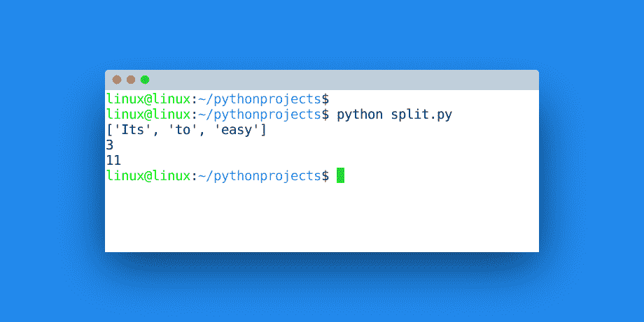

# 分割

> 原文： [https://pythonbasics.org/split/](https://pythonbasics.org/split/)

可以使用`split(param)`方法将字符串拆分为子字符串。 此方法是字符串对象的一部分。 该参数是可选的，但是您可以分割特定的字符串或字符。

给定一个句子，可以将字符串拆分为单词。 如果您有一个段落，则可以按短语拆分。 如果您有一个单词，可以将其拆分为单个字符。

在大多数情况下，`split()`方法可以。 对于字符，可以使用列表方法。


## 字符串分割

如果您有一个字符串，则可以将其细分为几个字符串。 该字符串需要至少有一个分隔符，可以是一个空格。

默认情况下，`split`方法将使用空格作为分隔符。 调用该方法将返回所有子字符串的列表。

### 字符串到单词

下面的演示将字符串拆分为字符。

```py
s = "Its to easy"
words = s.split()
print(words)

```

`len()`方法将为您提供字符数和单词数：

```py
print(len(words))
print(len(s))

```

输出应类似于下图：



### 字符串到字符

如果要将单词拆分为字符，请改用`list()`方法：

```py
word = "Easy"
x = list(word)
print(x)

```

可以使用[`join`](https://pythonbasics.org/join/)方法重构字符串，该方法将序列组合为新字符串。

### 练习

1.  字符串可以拆分为多个字符吗？
2.  您可以将一个字符串拆分为这个字符串吗？：世界，地球，美国，加拿大
3.  给定一篇文章，您可以根据短语拆分它吗？

[下载示例](https://gum.co/dcsp)