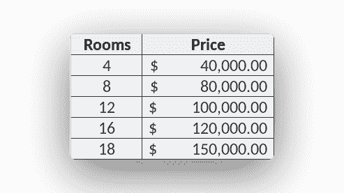

# 机器学习回归

> 原文： [https://pythonbasics.org/machine-learning-regression/](https://pythonbasics.org/machine-learning-regression/)

线性回归算法可预测连续值（例如价格，温度）。这是针对初学者的机器学习算法系列中的另一篇文章。这是一种有监督的学习算法，您需要收集训练数据才能使其工作。


## 线性回归

### 简介

分类输出只能是离散值。 可以有`[0]`，`[1]`，`[2]`等。如果要输出价格或其他连续值怎么办？

然后，您使用回归算法。

假设您要根据特征预测房价。 收集数据是
的第一步。 特征可能是房间数量，以 m^2 为单位的面积，邻里质量等。



### 示例

写下特征：`#area_m2`。对于我们的示例代码，如下所示。

```py
from sklearn.linear_model import LinearRegression

X = [[4], [8], [12], [16], [18]]
y = [[40000], [80000], [100000], [120000], [150000]]

model = LinearRegression()
model.fit(X,y)

# predict
rooms = 11
prediction = model.predict([[rooms]])
print('Price prediction: $%.2f' % prediction)

```

然后，您可以根据该数据创建绘图（如果需要）。您看到面积与价格之间存在相关性。

这是线性关系。您可以使用线性回归算法预测价格。

### 解释

首先，从学习的过程中导入线性回归算法，然后定义训练数据`X`和`Y`，其中`x`是面积，`y`是价格。

```py
model = LinearRegression()
model.fit(X,y)

```

线性回归算法由于存在线性关系，因此我们使用训练数据来训练算法。

现在已经对算法进行了训练，您可以使用该区域进行预测了。一个新示例，可以为您预测价格。

```py
rooms = 11
prediction = model.predict([[rooms]])
print('Price prediction: $%.2f' % prediction)

```

仅当数据集中存在线性关系时，算法`LinearRegression`才有效。如果没有，则需要多项式算法。

绘图以确认存在线性关系。

[下载示例和练习](https://gum.co/MnRYU)