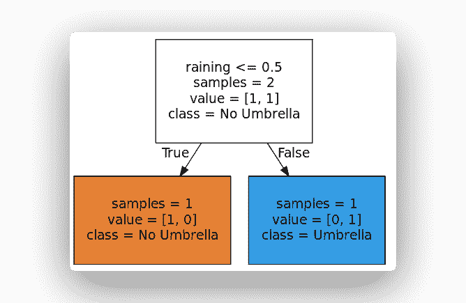

# 决策树

> 原文： [https://pythonbasics.org/decision-tree/](https://pythonbasics.org/decision-tree/)

决策树是最流行的监督式机器学习算法之一。

是从观察到结论的预测模型。 观察结果以分支表示，结论以叶子表示。

如果模型的目标变量可以采用离散值集，则为分类树。

如果模型的目标变量可以采用连续值，则为回归树。


决策树在统计和数据挖掘中也很常见。 这是一个简单但有用的机器学习结构。

## 决策树

### 简介

如何理解决策树？ 让我们举一个二进制的例子！

在计算机科学中，树木从上到下倒置生长。

最重要的问题是称为根节点的问题。 就像真正的树木一样，一切都从那里开始。

该问题有两个可能的答案，因此答案（在这种情况下）是从树中引出的两个分支节点。

所有不是根或分支的东西都是叶子。 叶子节点可以填充其他答案或条件。 离开也可以称为决策。

您可以重复此过程，直到“决策树”完成为止。 从理论上讲，就是这么简单。



### 算法

算法将其处理为：

> 决策树具有对象，而对象具有语句。
> 每个语句都有特征。
> 特征是对象的属性。
> 算法会研究此过程，直到完成每个语句和每个特征。

要以编程语言使用决策树，请执行以下步骤：

1.  呈现数据集。
2.  训练模型，从描述性特征和目标特征中学习。
3.  继续树直到完成一个标准。
4.  创建代表预测的叶节点。
5.  显示实例并沿着树运行，直到到达叶节点。

做完了！

### 数据集

我们从一个数据集开始

| 下雨 | 决策 |
| --- | --- |
| 否 | 不打伞 |
| 是 | 打伞 |

可以简化为：

| 下雨 | 决策 |
| --- | --- |
| 0 | 0 |
| 1 | 1 |

因此，相应的`X`（特征）和`Y`（决策/标签）为：

```py
X = [[0], [1]]
Y = [0, 1]

```

### 决策树代码

Sklearn 支持开箱即用的决策树。
然后，您可以运行以下代码：

```py
from sklearn import tree
from sklearn.model_selection import train_test_split
import numpy as np

# Create Decision Tree
features = ['raining']
X = [[0], [1]]
Y = [0, 1]

clf = tree.DecisionTreeClassifier()
clf.fit(X,Y)

# Visualize Tree
dotfile = open("dtree.dot", 'w')
tree.export_graphviz(clf, out_file = dotfile, feature_names=features, filled=True, round\
ed=True, impurity=False, class_names=['No Umbrella','Umbrella'])
dotfile.close()

```

这将创建树并输出一个点文件。 您可以使用 [Webgraphviz](http://webgraphviz.com/) 通过在其中粘贴点代码来形象化树。

创建模型将能够对未知实例进行预测，因为它可以对已知描述性特征与已知目标特征之间的关系进行建模。

```py
print( clf.predict([[0]]) )

```

### 重要概念

最后，快速回顾一下决策树和机器学习的 4 个重要概念。

1.  **期望值**：表示随机变量的期望值。 对决策树进行了预期价值分析，以确定风险的严重性。 为此，我们必须以 0.0 到 1.0 之间的数字来衡量风险的可能性。

2.  **熵**：测量信息。 是指定新实例是否应归为一个或另一个实例所需的预期信息量。 熵的思想是相对于可能的分类类别量化概率分布的不确定性。

3.  **准确性**：是做出的正确预测数除以做出的预测总数。 我们要做的是检查机器学习模型的准确性。

4.  **过拟合**：之所以发生，是因为训练模型试图尽可能地拟合训练数据。 为了防止这种情况，请尝试减少数据中的噪音。

这就是决策树和机器学习的基础知识！

[下载示例和练习](https://gum.co/MnRYU)