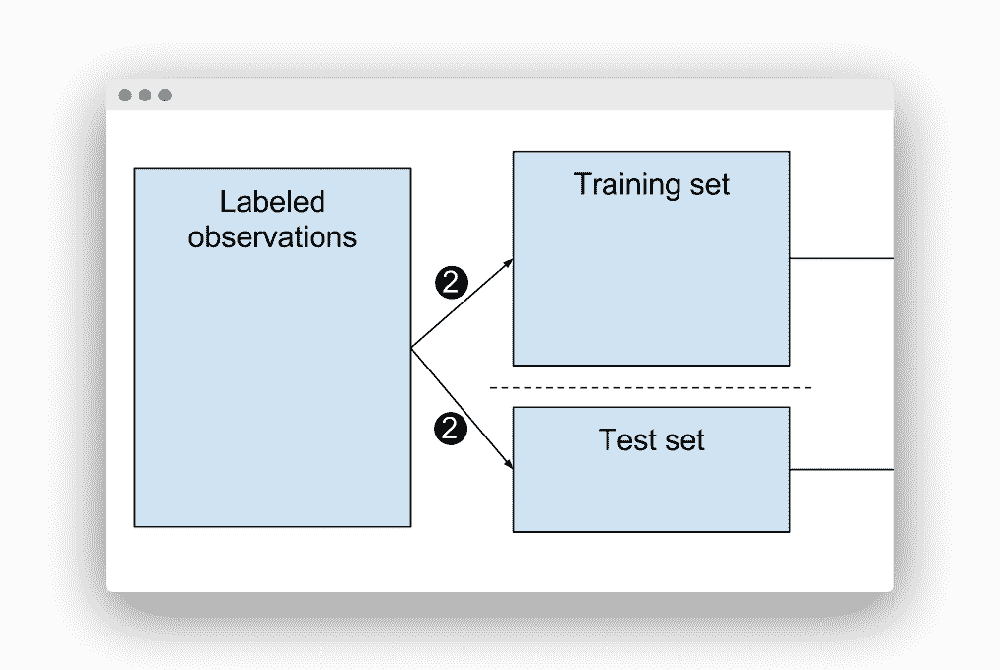

# 训练测试拆分

> 原文： [https://pythonbasics.org/split-train-test/](https://pythonbasics.org/split-train-test/)

数据是无限的。 数据科学家每天都要处理！

有时我们有数据，我们有特征，我们想尝试预测会发生什么。

为此，数据科学家将这些数据放入机器学习中以创建模型。


让我们举个例子：

1.  计算机必须确定照片中是否包含猫或狗。
2.  计算机具有训练阶段和测试阶段以学习如何进行。
3.  数据科学家收集了数千张猫和狗的照片。
4.  该数据必须分为训练集和测试测试。

然后是拆分进来的时候。

## 训练测试拆分

### 拆分



知道我们无法对训练的相同数据进行测试，因为结果会令人怀疑……我们如何知道训练和测试使用的数据百分比？

容易，我们有两个数据集。

*   一个具有独立特征，称为（`x`）。
*   一个具有因变量，称为（`y`）。

为了拆分它，我们这样做：

```
x_train – x_test / y_train – y_test
```

这是一个简单的公式，对吧？

`x_train`和`y_train`成为机器学习的数据，能够创建模型。

创建模型后，输入`x_test`，输出应等于`y_test`。

模型输出与`y_test`测试的距离越近：模型越精确。

```py
>>> import numpy as np
>>> from sklearn.model_selection import train_test_split
>>> X, y = np.arange(10).reshape((5, 2)), range(5)
>>> X
array([[0, 1],
       [2, 3],
       [4, 5],
       [6, 7],
       [8, 9]])
>>> list(y)
       [0, 1, 2, 3, 4]

```

然后拆分，让 33% 作为测试集（剩下的用于训练）。

```py
>>> X_train, X_test, y_train, y_test = train_test_split(X, y, test_size=0.33, random_state=42)

```

您可以验证自己有两组：

```py
>>> X_train
array([[4, 5],
       [0, 1],
       [6, 7]])
>>> X_test
array([[2, 3],
       [8, 9]])
>>> y_train
[2, 0, 3]
>>> y_test
[1, 4]
>>>

```

数据科学家可以将用于统计和机器学习的数据分为两个或三个子集。

*   两个子集将进行训练和测试。
*   三个子集将是训练，验证和测试。

无论如何，科学家都希望进行预测以创建模型并测试数据。

当他们这样做时，可能会发生两件事：过拟合和欠拟合。

### 过拟合

过拟合比欠拟合最常见，但是为了避免影响模型的可预测性，不应进行过拟合。

那么，那意味着什么呢？

当模型过于复杂时，可能会发生过拟合。

过拟合意味着我们训练的模型训练得“太好”，并且与训练数据集过于紧密。

但是，如果感觉太好，为什么会有问题呢？ 问题在于，训练数据的准确性将无法对未训练或新数据进行准确性。

为避免这种情况，与观察数相比，数据不能包含许多特征/变量。

### 欠拟合

那衣服不足呢？

当模型太简单时，可能会导致欠拟合，这意味着模型不适合训练数据。

为了避免这种情况，数据需要足够的预测变量/独立变量。

之前，我们提到过验证。

### 验证

交叉验证是指科学家将数据分为（k）个子集，并在 k-1 上训练那些子集之一。

最后一个子集是用于测试的子集。

一些库最常用于训练和测试。

*   **Pandas**：用于将数据文件作为 Pandas 数据帧加载并进行分析。
*   **Sklearn**：用于导入数据集模块，加载样本数据集并运行线性回归。
*   **Matplotlib**：使用`pyplot`绘制数据图。

最后，如果需要拆分数据库，请首先避免过拟合或欠拟合。

进行训练和测试阶段（并根据需要进行交叉验证）。

使用更适合所需工作的库。

机器学习可以为您提供帮助，但是您必须很好地使用它。

[下载示例和练习](https://gum.co/MnRYU)