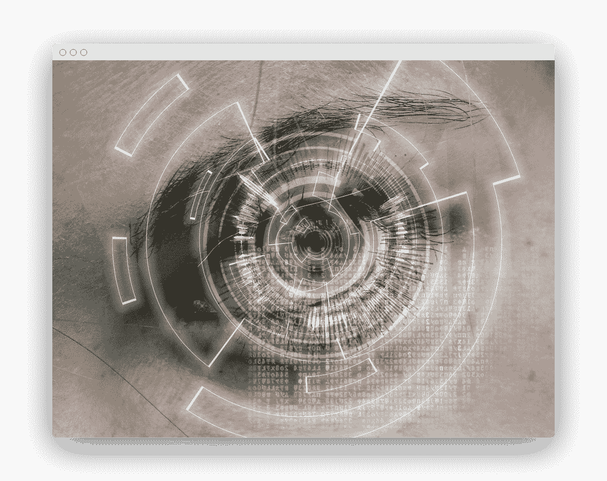

# 人脸检测

> 原文： [https://pythonbasics.org/face-detection/](https://pythonbasics.org/face-detection/)

人脸检测系统是最常用的人工智能之一。

同时，安全性和机器人技术以不显眼的方式实现它，每次拍摄照片或将内容上传到社交媒体时，我们都会使用人脸检测。

它已经成为我们生活的一部分，而且大多数人甚至都没有注意到它的背后。


人脸检测看似简单，但事实并非如此。 是一项能够根据图像或视频帧识别和验证人员的技术。 在某种程度上类似于指纹或眼睛鸢尾花识别系统。

## Python 人脸检测

### 简介

那么，我们想对所有这些说些什么？ 每个知道如何编码的人都可以进行人脸检测。 开发人员和程序员都可以实现。

他们只需要一个库，例如 OpenCV。

他们还需要一种来自示例 Python 的编程语言。

而且，如果以前没有这样做，他们必须要有一点耐心。

您无法跳过所有步骤并立即采取行动，而不会出现一些错误。

### 为什么是 OpenCV？

OpenCV 意味着“开放源代码计算机视觉”，它是一个最初用 C++ 编写，后来又为 Python 编写的库，这是我们将要使用的编程语言。

该库具有提高计算效率的设计，并且非常注重实时应用程序。

听起来确实对人脸检测准确。 OpenCV 可以使用机器学习算法在图片中搜索人脸。

但是这个过程很棘手，因为面孔很复杂。 必须匹配成千上万的小图案和特征。



### 机器学习

机器学习算法具有称为分类器的任务。 分类器将面孔识别为成千上万个较小的，一口大小的任务，这样做更容易。

想象一下：一张脸可以有 6,000 个或更多的分类器，并且所有这些分类器都必须匹配才能被检测到。

算法从图片的左上方开始，然后向下移至小块数据。 这 6,000 个分类器必须对其进行测试，并且需要进行数百万次的计算。

很明显，您的计算机将停止运行。 如果您必须自己做这项工作，您会失去理智。


### 级联

OpenCV 使用级联来解决将面部检测到多个阶段的问题。

级联对每个块进行非常粗略和快速的测试。 如果该块通过，则进行更详细的测试，依此类推。

该算法可以具有 30 到 50 个级联，如果所有阶段都通过，则可以检测到人脸。

这使得实时进行面部识别成为可能。

级联是包含 OpenCV 数据的 XML 文件，用于检测对象。

### 示例

一旦安装了 OpenCV 并且您了解它之后，就该使用 Python 检查人脸检测的结果了。

```py
import cv2
import sys

imagePath = sys.argv[1]
cascPath = sys.argv[2]

faceCascade = cv2.CascadeClassifier(cascPath)

# read and convert image
image = cv2.imread(imagePath)
gray = cv2.cvtColor(image, cv2.COLOR_BGR2GRAY)

# detect faces in the image
faces = faceCascade.detectMultiScale(
    gray,
    scaleFactor=1.1,
    minNeighbors=5,
    minSize=(30, 30),
    #    flags = cv2.cv.CV_HAAR_SCALE_IMAGE
    )
print("Found {0} faces!".format(len(faces)))

# show face detections
for (x, y, w, h) in faces:
    cv2.rectangle(image, (x, y), (x+w, y+h), (255, 0, 0), 2)

cv2.imshow("Faces found", image)
cv2.waitKey(0)

```

使用以下命令运行程序：

```py
python3 face.py workplace-1245776_960_720.jpg haarcascade_frontalface_default.xml

```

您可以[在此处下载级联](https://github.com/shantnu/FaceDetect/raw/master/haarcascade_frontalface_default.xml)

可能会导致两件事：

当用高质量的相机拍摄并靠近脸部时，对面部识别更可能是准确的。

当图片分辨率不高且离人脸较远时，可能会出现误报的情况。

[下载示例和练习](https://gum.co/MnRYU)