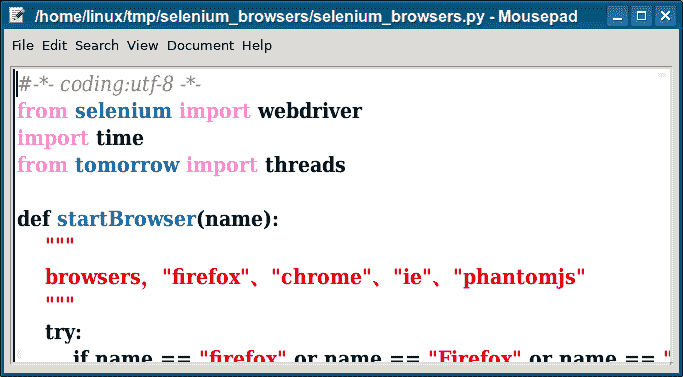

# Selenium 浏览器

> 原文： [https://pythonbasics.org/selenium_browsers/](https://pythonbasics.org/selenium_browsers/)

Selenium 使您可以自动化 Web 浏览器。 Selenium 是一个 Python 模块。 除了 Python 模块之外，您还需要 Web 驱动程序。

通过 Python，您可以控制 Firefox，Chrome，Internet Explorer，Edge 和许多其他浏览器。 您可以打开一个新的 URL，单击按钮等等。


## 网络浏览器

### Selenium 浏览器

下面的 Selenium 浏览器代码启动了多个 Web 浏览器。 他们打开一个网站，然后关闭浏览器。 必须安装 Web 驱动程序才能起作用。

```py
#-*- coding:utf-8 -*-
from selenium import webdriver
import time
from tomorrow import threads

def startBrowser(name):
    """
    browsers，"firefox"、"chrome"、"ie"、"phantomjs"
    """
    try:
        if name == "firefox" or name == "Firefox" or name == "ff":
            print("start browser name :Firefox")
            driver = webdriver.Firefox()
            return driver
        elif name == "chrome" or name == "Chrome":
            print("start browser name :Chrome")
            driver = webdriver.Chrome()
            return driver
        elif name == "ie" or name == "Ie":
            print("start browser name :Ie")
            driver = webdriver.Ie()
            return driver
        elif name == "phantomjs" or name == "Phantomjs":
            print("start browser name :phantomjs")
            driver = webdriver.PhantomJS()
            return driver
        else:
            print("Not found this browser,You can use ‘firefox‘, ‘chrome‘, ‘ie‘ or ‘phantomjs‘")
    except Exception as msg:
        print("message: %s" % str(msg))

@threads(5)
def run_case(name):
    driver = startBrowser(name)
    driver.get("https://news.ycombinator.com/")
    time.sleep(3)
    print(driver.title)
    driver.close()
    driver.quit()

if __name__ == "__main__":
    names = ["chrome", "ff", "ie"]
    for i in names:
        run_case(i)

```



[下载示例](https://gum.co/GjuJxo)