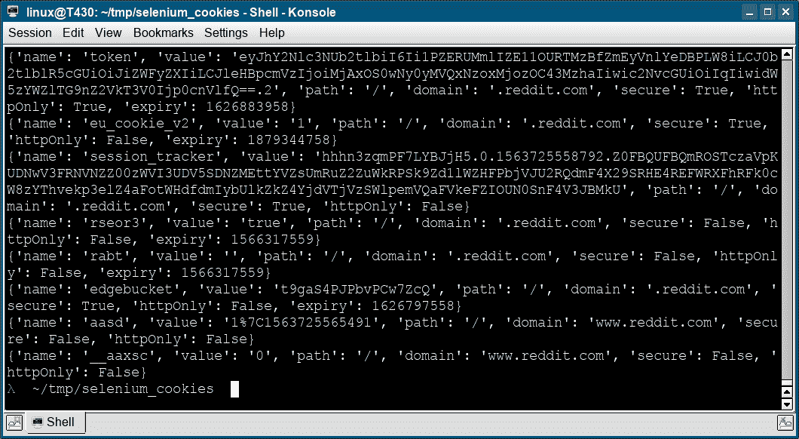
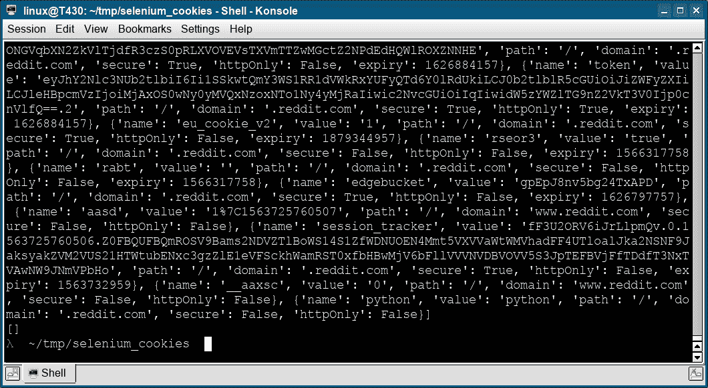

# Selenium Cookie

> 原文： [https://pythonbasics.org/selenium_cookies/](https://pythonbasics.org/selenium_cookies/)

Cookie 是 Web 服务器提供给 Web 浏览器的消息。 这使您的 Web 浏览器可以存储登录信息，用户名，购物车等信息。 网站需要在不同页面之间记住这一点，有时会使用 cookie。

在 Selenium 中，您可以使用`get_cookies()`和`add_cookie()`方法获取并设置 cookie。

### Selenium Cookie

下面的 Selenium cookie 代码获取站点 reddit 设置的所有 cookie。

```py
# -*- coding: utf-8 -*-
from selenium import webdriver
import time

browser=webdriver.Firefox()
browser.get("https://reddit.com")
cookies = browser.get_cookies()
for cookie in cookies:
    print(cookie)

browser.quit()

```



### Selenium 添加删除 cookie

下面的 Selenium 代码获取 cookie，然后添加一个新 cookie，再次获取它们（显示），最后将其删除。

```py
# -*- coding: utf-8 -*-
from selenium import webdriver
import time

browser=webdriver.Firefox()
browser.get("https://reddit.com")
print(browser.get_cookies())
browser.add_cookie({"name":"python","domain":"reddit.com","value":"python"})
print(browser.get_cookies())
browser.delete_all_cookies()
print(browser.get_cookies())
browser.close()

```



[下载示例](https://gum.co/GjuJxo)