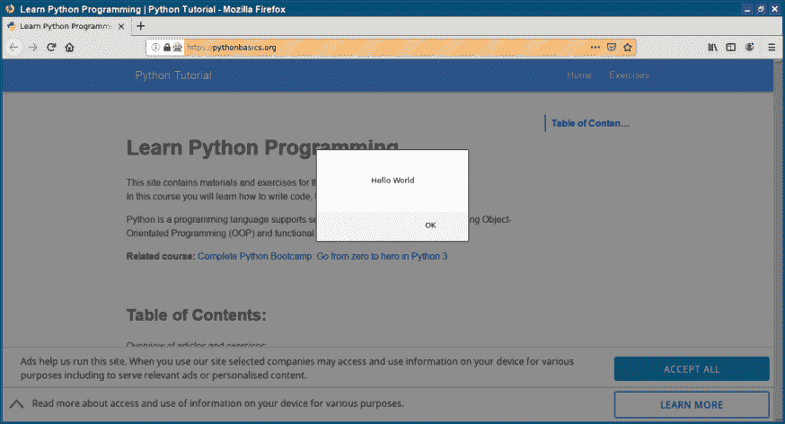

# Selenium 执行 JavaScript

> 原文： [https://pythonbasics.org/selenium_execute_javascript/](https://pythonbasics.org/selenium_execute_javascript/)

Selenium Webdriver 可以执行 Javascript。 加载页面后，您可以执行所需的任何 JavaScript。 必须安装 Web 驱动程序，Selenium 才能工作。

只需调用方法`execute_script(js)`，其中 js 是您的 JavaScript 代码。


## javascript

### Selenium 执行 javascript

加载页面后，下面的程序将运行一行 javascript 命令。 这将在网页中显示警报框。

```py
from selenium import webdriver

driver=webdriver.Firefox()
driver.implicitly_wait(3)
driver.get("https://pythonbasics.org")
js = 'alert("Hello World")'
driver.execute_script(js)

```



[下载示例](https://gum.co/GjuJxo)