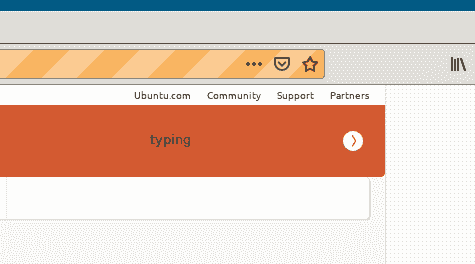
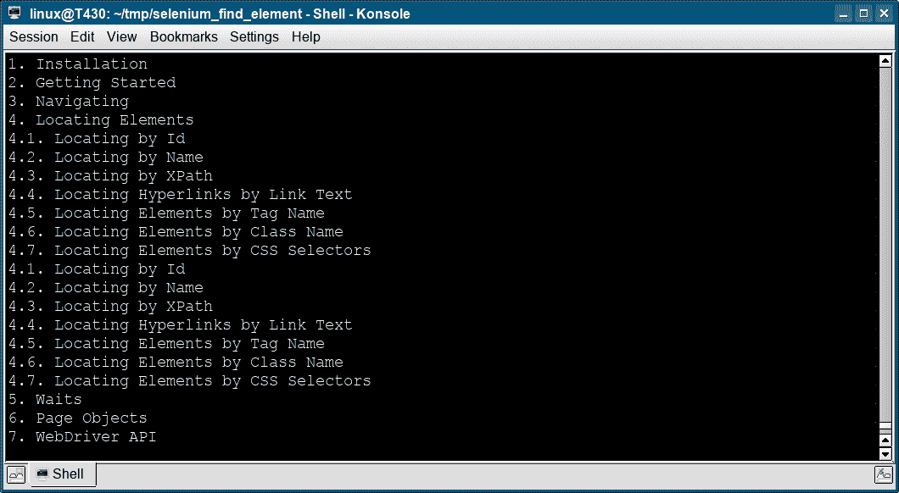
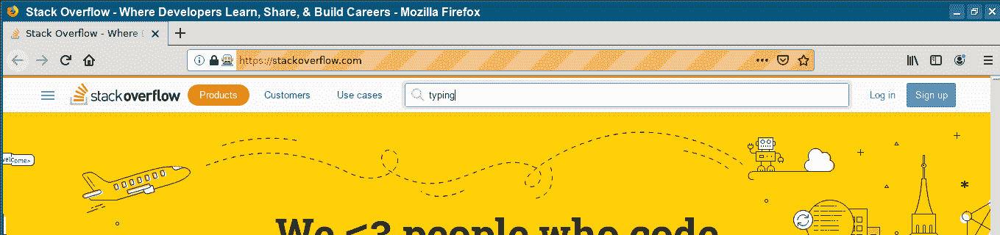

# Selenium 按 ID 查找元素

> 原文： [https://pythonbasics.org/selenium_find_element/](https://pythonbasics.org/selenium_find_element/)

网页元素可以通过其 ID 来实现。 这是在带有 Selenium 的网页上选择元素的方法之一。

您必须具有可通过开发人员工具获得的元素 ID。 您也可以使用 id 或 css 选择网页元素。

## 查找元素

### Selenium 按 ID 查找元素

Selenium 代码使用`find_element`和 ID 来选择搜索框。 然后，它在搜索框中键入一条消息。

```py
#_*_coding: utf-8_*_

from selenium import webdriver
from selenium.webdriver.common.by import By
import time

browser=webdriver.Firefox()
browser.get("https://wiki.ubuntu.com")
element=browser.find_element(By.ID,"searchinput")
element.send_keys("typing")
print(element)
time.sleep(3)
browser.close()

```



### Selenium 查找列表项目

下面的 Python 代码使用 selenium 在网页上查找列表项`li`。

```py
from selenium import webdriver
from selenium.webdriver.common.by import By

driver = webdriver.Firefox()
driver.get("https://selenium-python.readthedocs.io/locating-elements.html")

items = driver.find_elements(By.XPATH, '//li')
for item in items:
    print(item.text)

```



### Selenium 按名称查找元素

Selenium 可以按名称而不是代码查找元素。 这样完成：

```py
#_*_coding: utf-8_*_

from selenium import webdriver
from selenium.webdriver.common.by import By
import time

browser=webdriver.Firefox()
browser.get("https://stackoverflow.com")
element = browser.find_element_by_name("q")
element.send_keys("typing")
print(element)
time.sleep(3)
browser.close()

```

