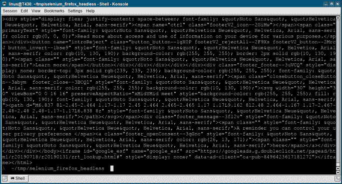

# Selenium 无头 Firefox

> 原文： [https://pythonbasics.org/selenium_firefox_headless/](https://pythonbasics.org/selenium_firefox_headless/)

无头浏览器是没有用户界面的 Web 浏览器。 如果您想启动网络浏览器来执行任务，但又不想或不需要查看它，那就很好了。

您可以使用 Firefox 或 Chrome 之类的 GUI 浏览器。 然后将其设置为无头模式。 无论如何，都需要安装 Web 驱动程序。

## Selenium

### Selenium 无头 Firefox

下面的代码启动 Firefox，但处于无头模式。 它可以执行 Firefox 可以执行的任何操作，但是在屏幕上将不可见。 下面的屏幕截图输出了网页的 html 代码，但这是可选的。

```py
from selenium import webdriver

try:
    fireFoxOptions = webdriver.FirefoxOptions()
    fireFoxOptions.set_headless()
    brower = webdriver.Firefox(firefox_options=fireFoxOptions)

    brower.get('https://pythonbasics.org')
    print(brower.page_source)
finally:
    try:
        brower.close()
    except:
        pass

```



[下载示例](https://gum.co/GjuJxo)