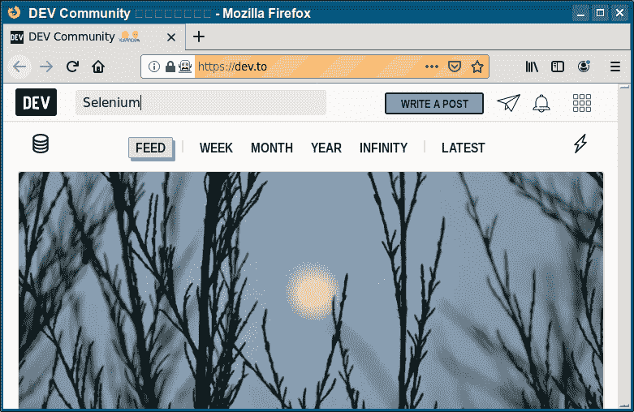

# Selenium Firefox

> 原文： [https://pythonbasics.org/selenium_firefox/](https://pythonbasics.org/selenium_firefox/)

Firefox 可以由 Python 控制。 为此，您需要 Selenium 模块和 Web 驱动程序。 Python 代码启动 Web 浏览器，然后完全控制它。

然后，该代码可以执行您在网络浏览器中可以执行的任何操作，例如打开页面，发送按键或单击按钮。


## firefox

### Selenium Firefox

看一下 Selenium Firefox 代码。 首先导入 webdriver，然后使其启动 firefox。
打开并获取页面，并可以选择“发送”按钮。

```py
# coding=utf-8
from selenium import webdriver

driver = webdriver.Firefox()
driver.get("https://dev.to")

driver.find_element_by_id("nav-search").send_keys("Selenium")

```



[下载示例](https://gum.co/GjuJxo)