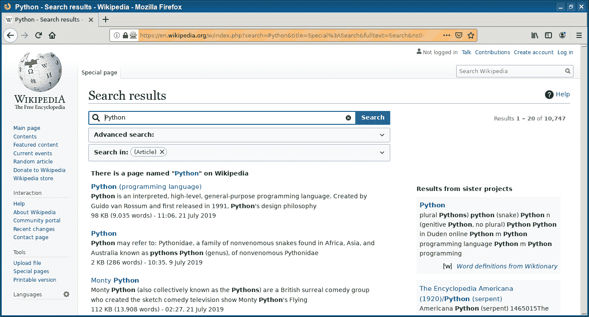

# Selenium 键盘

> 原文： [https://pythonbasics.org/selenium_keyboard/](https://pythonbasics.org/selenium_keyboard/)

Selenium Webdriver 可以在任何网页上输入按键或键入内容。 Selenium 是使网络浏览器自动化的 Python 模块。

Selenium Webdriver 启动浏览器，浏览器加载网页，选择文本框和类型。


## 键盘

### Selenium 键盘

下面的 Selenium 键盘代码示例可以完成所有这些操作。 在此示例中，它在 Wikipedia 上进行了自动搜索，但是该原理可在任何站点上使用。

```py
# -*- coding: utf-8 -*-
from selenium import webdriver
from selenium.webdriver.common.by import By
from selenium.webdriver.common.keys import Keys
from selenium.webdriver.support import expected_conditions as EC
from selenium.webdriver.support.wait import WebDriverWait
import time

browser=webdriver.Firefox()
try:
        browser.get("https://en.wikipedia.org")
        print(browser.title)
        input=browser.find_element_by_id("searchInput")
        input.send_keys("Python")
        input.send_keys(Keys.ENTER)
        wait=WebDriverWait(browser,10)
        wait.until(EC.presence_of_element_located((By.ID,"content")))
        print(browser.title)
        #print(browser.get_cookies())
        #print(browser.page_source)
        time.sleep(10)
finally:
        browser.close()

```



[下载示例](https://gum.co/GjuJxo)