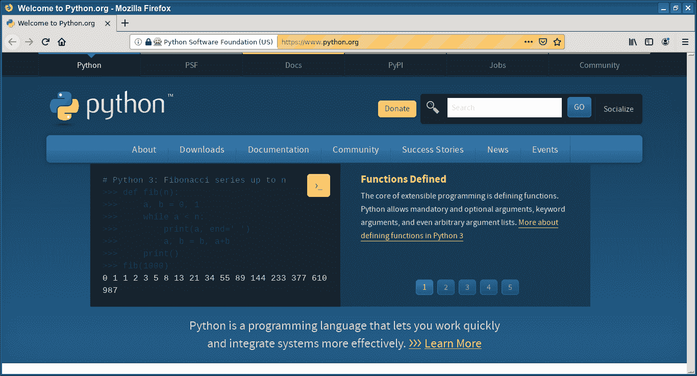

# Selenium 最大化

> 原文： [https://pythonbasics.org/selenium_maximize/](https://pythonbasics.org/selenium_maximize/)

通过 Python Selenium 最大化 Web 浏览器非常容易。 简而言之，您要做的就是启动浏览器并调用`maximum_window()`。

（Selenium 是一个 Python 模块，使用 Web 驱动程序来为您控制 Web 浏览器）


## Selenium

### Selenium 最大化

首先导入 webdriver 和时间模块。 您需要安装 Selenium Web 驱动程序。 然后使用`webdriver.Firefox()`打开 firefox，并使用`maximize_window().`调用最大化窗口

```py
from selenium import webdriver 
import time

driver = webdriver.Firefox()
driver.maximize_window()
time.sleep(5)

driver.get("https://www.python.org")

```



[下载示例](https://gum.co/GjuJxo)