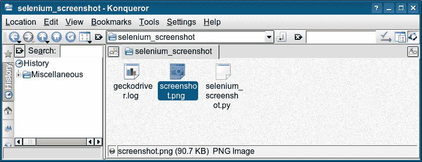

# Selenium 截图

> 原文： [https://pythonbasics.org/selenium_screenshot/](https://pythonbasics.org/selenium_screenshot/)

网页截图可以使用 Python Selenium 自动获取。 首先加载 Selenium 模块和时间模块。 您需要时间模块来等待页面加载完成。

然后，一旦页面加载完毕，请截屏。 这可以是 png 文件或其他图像格式。 然后关闭网络浏览器，否则它将保持打开状态。


## Selenium 截图

### 示例

您可以使用`get_screenshot_as_file()`方法拍摄网页的屏幕快照，并以文件名作为参数。

下面的程序使用 firefox 加载网页并截图，但是任何 Web 浏览器都可以。

```py
from selenium import webdriver
from time import sleep

driver = webdriver.Firefox()
driver.get('https://www.python.org')
sleep(1)

driver.get_screenshot_as_file("screenshot.png")
driver.quit()
print("end...")

```

屏幕快照图像将与 Python 脚本存储在同一目录中。 除非您明确定义必须存储屏幕快照的路径。



[下载示例](https://gum.co/GjuJxo)