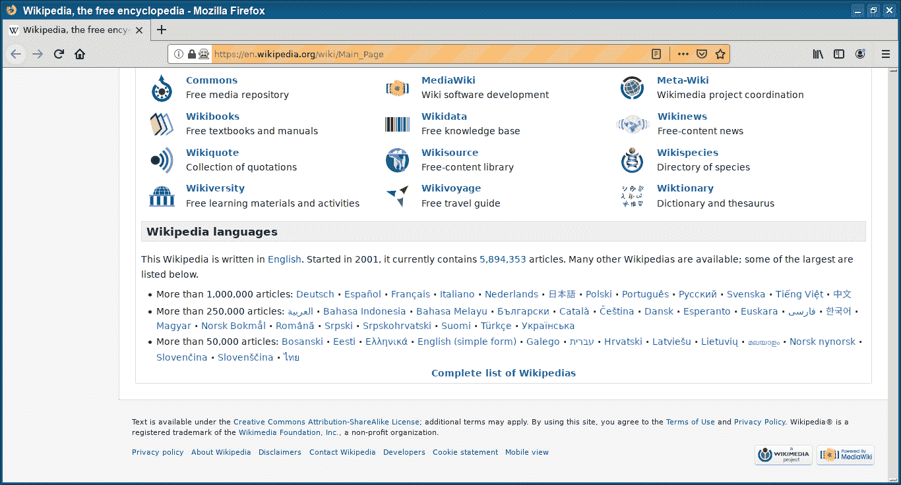

# Selenium 向下滚动

> 原文： [https://pythonbasics.org/selenium_scroll_down/](https://pythonbasics.org/selenium_scroll_down/)

您是否希望 Selenium 浏览器滚动到页面末尾？ 您可以使用代码，确切地说是 javascript 代码。

加载网页后，您可能需要向下滚动。您可以向下滚动特定数量或一直向下滚动到底部。


## Selenium 向下滚动

### 示例

Selenium 向下滚动代码如下所示。 它使用 javascript 校准方法`execute_script()`，以滚动到网页的末尾。

```py
#_*_coding: utf-8_*_
from selenium import webdriver
import time

browser=webdriver.Firefox()
browser.get("https://en.wikipedia.org")
browser.execute_script("window.scrollTo(0,document.body.scrollHeight)")
time.sleep(3)
browser.close()

```



[下载示例](https://gum.co/GjuJxo)