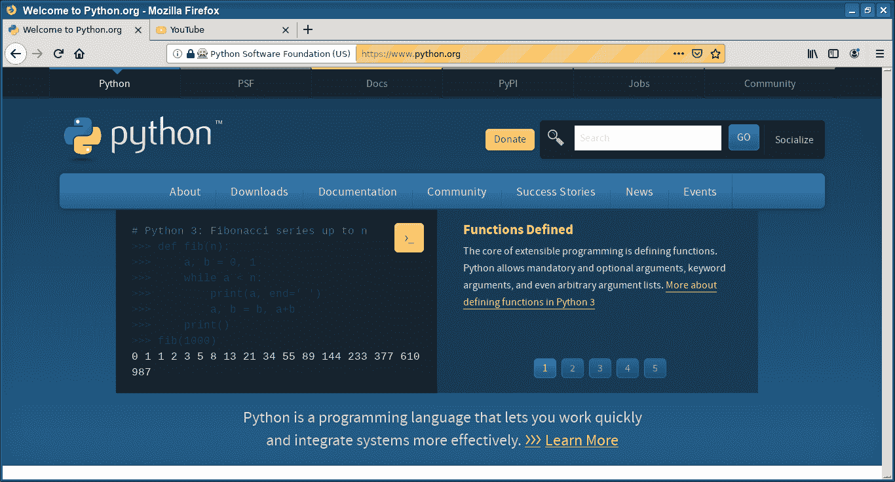

# Selenium 切换到窗口

> 原文： [https://pythonbasics.org/selenium_switch_to_window/](https://pythonbasics.org/selenium_switch_to_window/)

也可以从 Python 代码切换窗口或选项卡。 下面的示例使用 selenium 模块和 Web 驱动程序。

这应该适用于所有受支持的 Web 浏览器，包括 Chrome，Firefox，IE 和所有其他浏览器。

## 切换到窗口

### Selenium 切换到窗口

Selenium 切换到如下所示的窗口代码。 它会启动 Firefox，打开一个网页，然后打开一个包含不同网站的新标签页和窗口。

```py
# -*- coding: utf-8 -*-
from selenium import webdriver
import time

browser=webdriver.Firefox()
browser.get("https://www.reddit.com")
browser.execute_script("window.open()")
print(browser.window_handles)
browser.switch_to_window(browser.window_handles[1])
browser.get("https://www.youtube.com")
time.sleep(1)
browser.switch_to_window(browser.window_handles[0])
browser.get("https://python.org")
#browser.close()

```



[下载示例](https://gum.co/GjuJxo)