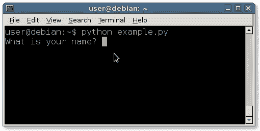

# 键盘输入

> 原文： [https://pythonbasics.org/keyboard-input/](https://pythonbasics.org/keyboard-input/)

在 Python 和许多其他编程语言中，您可以获取用户输入。 不用担心，您不需要编写键盘驱动程序。

`input()`函数将要求用户输入键盘。 如果您仍在使用 Python 2，则可以使用`raw_input()`函数。


## 示例

如果指定了参数，则输入函数会提示文本。 该函数从键盘读取输入，将其转换为字符串并删除换行符（`Enter`）。

输入以下脚本并进行尝试（另存为`key.py`）

```py
#!/usr/bin/env python3

name = input('What is your name? ')
print('Hello ' + name)

job = input('What is your job? ')
print('Your job is ' + job)

num = input('Give me a number? ')
print('You said: ' + str(num))

```

输出应该是这样的，具体取决于您的终端：



在阅读本文时，也许您已经习惯了语音输入或其他类型的人机交互。 无论哪种键盘输入对于编码仍然非常有用。

## 练习

试试这些练习：

1.  编写一个询问电话号码的程序。
2.  编写一个程序，询问用户首选的编程语言。

完成这些步骤后，继续下一个练习。

[下载示例](https://gum.co/dcsp)