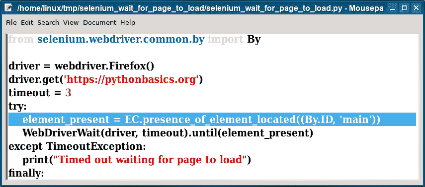

# Selenium 等待页面加载

> 原文： [https://pythonbasics.org/selenium_wait_for_page_to_load/](https://pythonbasics.org/selenium_wait_for_page_to_load/)

等待页面加载 Python Selenium。 在本文中，您将学习如何做到这一点。 这有点违反直觉。

Selenium 可让您自动执行浏览器，但不需要`time.sleep`即可等待页面加载完成。 实际上，它的工作方式与您预期的不同。


## 示例

### Selenium 等待页面加载

下面的代码块向您展示了如何等待页面加载完成。 它使用超时。 它等待元素显示在页面上（您需要一个元素 ID）。

然后，如果页面已加载，则显示页面已加载。 如果超过了超时时间（以秒为单位），它将显示超时错误。

```py
from selenium import webdriver
from selenium.common.exceptions import TimeoutException
from selenium.webdriver.support.ui import WebDriverWait
from selenium.webdriver.support import expected_conditions as EC
from selenium.webdriver.common.by import By

driver = webdriver.Firefox()
driver.get('https://pythonbasics.org')
timeout = 3
try:
    element_present = EC.presence_of_element_located((By.ID, 'main'))
    WebDriverWait(driver, timeout).until(element_present)
except TimeoutException:
    print("Timed out waiting for page to load")
finally:
    print("Page loaded")

```



[下载示例](https://gum.co/GjuJxo)