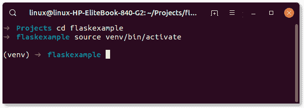
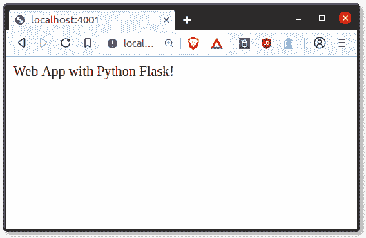

# Flask 教程：Hello World

> 原文： [https://pythonbasics.org/Flask-Tutorial-Hello-World/](https://pythonbasics.org/Flask-Tutorial-Hello-World/)

欢迎！ 在本教程中，您将学习如何使用 Python [Flask](http://flask.pocoo.org/) 创建第一个 **Web 应用程序**。 如果您喜欢学习视频课程，建议您参考以下课程：


## 设置项目

Python 项目位于[虚拟环境](https://pythonbasics.org/virtualenv/)中。 每个项目都位于不同的虚拟环境中。 这样可以防止程序包冲突。Python 软件包不应在系统范围内安装。

考虑一下：

*   项目 A 需要 Flask 版本 0.2
*   项目 B 需要 Flask 版本 0.3
*   项目 C 需要 Flask 版本 0.1

由于存在软件包冲突，因此无法在系统范围内安装软件包。

### 创建虚拟环境

打开终端（请参阅下面的如何快速打开终端）。 然后安装`python3-venv`。

在 Ubuntu Linux 上，您可以运行以下命令：

```py
sudo apt-get install python3-venv

```

首先使用命令创建项目目录

```py
$ mkdir flaskexample
cd flaskexample

```

然后，您可以使用以下命令创建新的虚拟环境：

```py
$ python3 -m venv venv

```

### 激活虚拟环境

虚拟环境已创建，但尚未激活。在 Linux 上激活虚拟环境，请使用以下命令：

```py
source venv/bin/activate

```

在 Microsoft Windows 上，请改用以下命令：

```py
$ venv\Scripts\activate

```

您应该看到：

```py
(venv) ➜  flaskexample 

```



## 安装 Flask

第一步是安装 Flask。 Python 附带了一个名为`pip`的软件包管理器。 它使用名为 PyPI 的官方 Python 软件包存储库。

要安装 Python 软件包，您需要打开一个终端。 这因操作系统而异。

*   在 Linux 上，您可以按组合键`Ctrl+Alt+T`打开终端。
*   在 Mac OS X 上，按`CMD + Space`键打开 Spotlight 搜索，然后键入`terminal`并按回车键。
*   在 Windows 上，按`Super + R`键并键入`cmd`，然后按`Enter`键。

您可以使用以下命令安装 Python 软件包：

```py
pip install <package-name>

```

在这种情况下，您要键入命令：

```py
pip install flask

```

然后确认其安装正确。 输入命令

```py
(venv) ➜  flaskexample python3

```

输出应为：

```py
>>> import flask
>>> 

```

如果您在下面看到输出，则表明 Flask 未安装在虚拟环境中。

```py
Python 3.7.3 (default, Aug 20 2019, 17:04:43) 
[GCC 8.3.0] on linux
Type "help", "copyright", "credits" or "license" for more information.
>>> import flask
Traceback (most recent call last):
  File "<stdin>", line 1, in <module>
ModuleNotFoundError: No module named 'flask'
>>> 

```



## HelloWorld

大！ 现在已经安装了所有内容，您可以创建第一个 Flask 应用程序。

使用下面的行在 Python 中导入 Flask。

```py
from flask import Flask

```

创建托管应用程序的应用程序

```py
app = Flask(__name__)

```

然后，您需要一个路由来调用 Python 函数。 路由会将您在浏览器中键入的内容（URL）映射到 Python 函数。

```py
@app.route('/')
    def index():

```

该函数应将某些内容返回到 Web 浏览器，

```py
return 'Web App with Python Flask!'

```

差不多完成了，服务器需要启动。 这将在端口 81 上启动 Web 应用程序。

```py
app.run(host='0.0.0.0', port=81)

```

在网络浏览器中输入网址 [http://localhost:81/](http://localhost:81/)。

代码摘要：

```py
from flask import Flask

app = Flask(__name__)

@app.route('/')
def index():
    return 'Web App with Python Flask!'

app.run(host='0.0.0.0', port=81)

```
