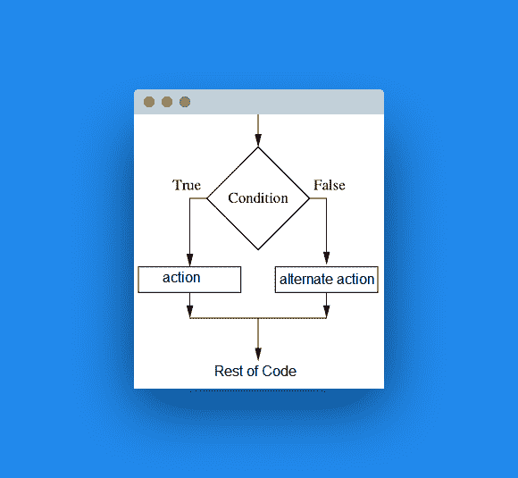

# `if`语句

> 原文： [https://pythonbasics.org/if-statements/](https://pythonbasics.org/if-statements/)

程序有时可能不得不做出选择。 这些选择可以根据特定条件执行不同的代码。 在 Python 中， `if`语句用于条件执行。

`if`语句可以与某些运算符组合，例如等于（`==`），大于（`>=`），小于（`<=`）且不等于（`!=`）。 可以使用关键字`or`以及`and`组合条件。


## 示例

在下面的示例中，我们显示了`if`语句的用法。复制以下程序并运行。

```py
#!/usr/bin/env python3

gender = input("Gender? ")
if gender == "male" or gender == "Male":
    print("Your cat is male")
else:
    print("Your cat is female")

age = int(input("Age of your cat? "))
if age < 5:
    print("Your cat is young.")
else:
    print("Your cat is adult.")

```

`if`语句的直观示例（单击放大）：



## 练习

做这些练习：

1.  编写一个程序，请求 1 到 10 之间的数字。如果该数字超出范围，则程序应显示“无效数字”。

2.  制作一个请求密码的程序。

完成后，继续下一个练习。

[下载示例](https://gum.co/dcsp)