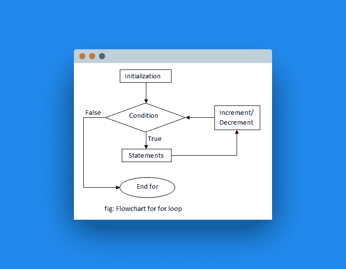

# `for`循环

> 原文： [https://pythonbasics.org/for-loops/](https://pythonbasics.org/for-loops/)

程序有时需要重复操作。 为了重复动作，我们可以使用`for`循环。在代码内部编写了一个`for`循环。`for`循环可以具有 1 个或多个指令。

`for`循环将重复一个代码块。 重复进行直到满足停止条件为止。 如果不满足停止条件，它将无限循环。

重复（循环）这些指令，直到满足条件为止。


## 示例

在下面的练习中，我们将对列表的每个项目重复执行操作。

第一个循环将为列表的每个项目重复打印函数。
第二个循环将对列表`num`的每个元素进行计算并打印结果。

在下面输入代码并运行程序。

```py
#!/usr/bin/env python3

city = ['Tokyo','New York','Toronto','Hong Kong']
print('Cities loop:')
for x in city:
    print('City: ' + x)

print('\n')  # newline

num = [1,2,3,4,5,6,7,8,9]
print('x^2 loop:')
for x in num:
    y = x * x
    print(str(x) + '*' + str(x) + '=' + str(y))

```

将文件另存为`loopexample.py`，然后使用以下命令运行代码：

```py
python loopexample.py

```

示意地，`for`循环可以做到这一点：



## 练习

请尝试以下练习：

1.  制作一个列出列表中的国家/地区的程序

    ```py
    clist = ['Canada','USA','Mexico','Australia']

    ```

2.  创建一个从 0 到 100 的循环
3.  使用一个循环制作一个乘法表。
4.  使用一个循环向后输出数字 1 至 10。
5.  创建一个`for`循环，对直到 10 的所有偶数进行计数
6.  创建一个循环，将 100 和 200 之间的数字相加

[下载示例](https://gum.co/dcsp)