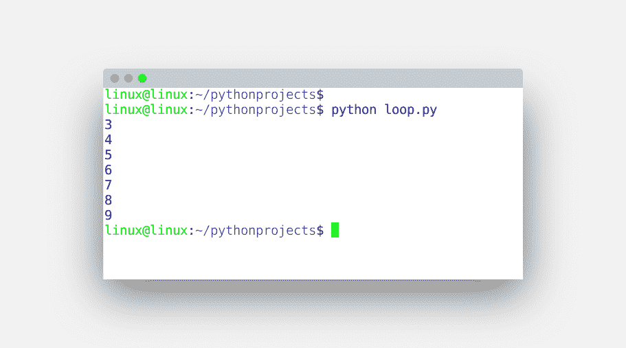
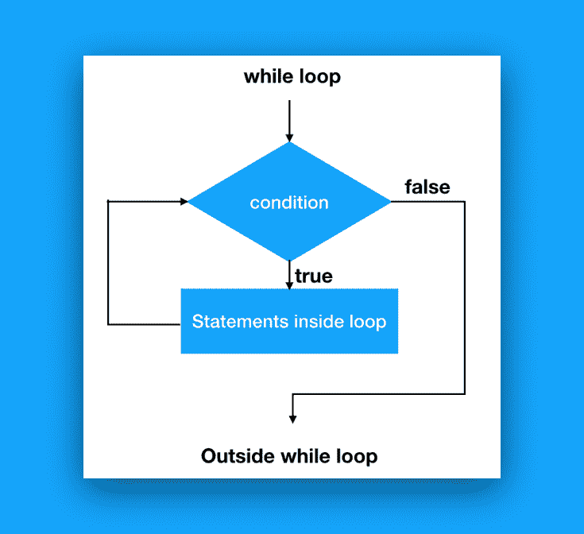

# `while`循环

> 原文： [https://pythonbasics.org/while-loop/](https://pythonbasics.org/while-loop/)

`while`循环重复执行代码，直到不满足条件为止。 与`for`循环不同，其中的迭代次数可能是未知的。`while `循环始终由条件和代码块组成。

与总是具有有限可数步数的`for`循环相反，`while`循环仅在条件为`false`时才结束。


## 示例

### `While`循环示例

下面的`while`循环定义了条件（`x < 10`），并重复指令直到该条件不成立。 输入此代码：

```py
#!/usr/bin/python

x = 3                              
while x < 10:
    print(x)
    x = x + 1

```

执行以下代码，直到不满足`x < 10`。与`for`循环不同，迭代器i在循环中增加。

保存然后使用您的 Python IDE 或从终端运行。



您也可以创建无限循环，这是条件永远不变的时候。

```py
while True:
    print('Forever')

```

在正常情况下，您希望程序在某个时候退出`while`循环。 如果条件发生变化，程序将自动退出`while`循环。 大多数情况下，这是通过迭代器完成的，但也可以通过布尔值（开关）来完成。

### 控制流程图

示意性地，`while`循环如下图所示。 这称为控制流程图（`cfg`）。 进入`while`循环时发生情况的直观方式。

应该注意的是，`while`循环中可以有多个语句。 如果代码变得很长，您还可以从循环内部调用函数。



## 练习

请尝试以下练习：

1.  编写一个程序，使用`while`循环列出下面的国家/地区。

    ```py
    clist = ["Canada","USA","Mexico"]

    ```

2.  `while`循环和`for`循环有什么区别？
3.  您可以在`while`循环中对数字求和吗？
4.  可以在`while`循环内使用`for`循环吗？

[下载示例](https://gum.co/dcsp)