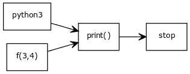

# 函数

> 原文： [https://pythonbasics.org/functions/](https://pythonbasics.org/functions/)

要对代码集进行分组，可以使用函数。 函数是可重复代码的一小部分。一个函数接受参数。

没有函数，我们只有一长串指令。 函数可以帮助您组织代码。 函数也可以重用，通常它们包含在模块中。


## 示例

### 函数

函数可以看作是可执行代码块。 一个函数可以使用一次或多次。

一个简单的函数示例是：

```py
def currentYear():
    print('2018')

currentYear()

```

在此示例中，将立即调用该函数。 函数定义始终以`def`关键字开头。

函数可以重用，一旦创建一个函数就可以在多个程序中使用。 打印函数就是一个例子。

### 具有参数的函数

在下面的示例中，我们有参数`x`和`y`。 输入此程序并将其另存为`summation.py`

```py
#!/usr/bin/env python3

def f(x,y):
    return x*y

print(f(3,4))

```

在此示例中，我们有两个函数：`f(x, y)`和`print()`。 函数`f(x, y)`使用`return`关键字将其输出传递给`print`函数。



### 返回变量

函数可以返回变量。 有时一个函数进行计算或有一些输出，可以将其提供给带有返回变量的程序。

在许多情况下，输出存储在变量中：

```py
result = f(3,4)
print(result)

```

在这种情况下，程序将使用参数 3 和 4 调用函数`f`，然后将输出保存到变量`result`中。

## 练习

试试下面的练习

1.创建一个将列表`mylist = [1,2,3,4,5]`求和的函数
2.是否可以在函数内部调用函数？
3.函数可以调用自身吗？ （提示：递归）
4.在一个函数中定义的变量可以在另一个函数中使用吗？ （提示：作用域）

完成这些步骤后，继续下一个练习。

[下载示例](https://gum.co/dcsp)