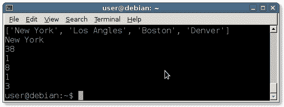

# 列表

> 原文： [https://pythonbasics.org/list/](https://pythonbasics.org/list/)

列表可以看作是一个集合：它们可以包含许多变量。 列表类似于物理列表，它们可以包含许多项目。

列表可以包含任意数量的元素。 它们类似于其他编程语言中的数组。 列表可以容纳各种变量：整数（整数），浮点数，字符，文本等。


## 示例

### 空列表

让我们创建一个空列表。 要定义一个空列表，您应该使用方括号。括号告诉 Python 该对象是一个列表。

```py
list = []

```

列表可以同时包含数字和文本。 无论内容如何，​​都可以相同的方式访问它们。

要访问列表，请在方括号之间添加下标，例如`list [0]`，`list [1]`等。

### 定义列表

上面定义了一个空列表。 列表可以包含各种数据。您可以创建如下的数字列表：

```py
ratings = [ 3,4,6,3,4,6,5 ]

```

列表可以包含字符串或字符：

```py
ratings = [ 'A','A','B','A','C','A' ]

```

要输出简单打印它们

```py
print(ratings)

```

您可以使用`for`循环逐项进行交互。

### 访问列表项

您可以使用方括号及其索引来访问列表项。 Python 开始从零开始计数，这意味着第一个元素为零。

为什么从零开始计数？

用于从零开始计数的计算机语言。 在首次创建编程语言时，从零开始计数是有意义的。 如今，改变这一传统真是奇怪。

要获得第一项，只需在列表名称后添加方括号和零。

```py
print(rating[0])

```

增量编号可以访问所有其他元素，以打印您要使用的第二项（1），以打印您要使用的第三项（2）。

```py
print(rating[1])

```

### 列表示例

输入以下代码并运行：

```py
#!/usr/bin/python

list = [ "New York", "Los Angles", "Boston", "Denver" ]

print(list)     # prints all elements
print(list[0])  # print first element

list2 = [1,3,4,6,4,7,8,2,3]

print(sum(list2))
print(min(list2))
print(max(list2))
print(list2[0])
print(list2[-1])

```

这应该输出：



## 练习

1.  制作一个显示美国各州的程序。

    ```py
    states = [ 'Alabama','Alaska','Arizona','Arkansas','California','Colorado','Connecticut','Delaware','Florida','Georgia','Hawaii','Idaho','Illinois','Indiana','Iowa','Kansas','Kentucky','Louisiana','Maine','Maryland','Massachusetts','Michigan','Minnesota','Mississippi','Missouri','Montana','Nebraska','Nevada','New Hampshire','New Jersey','New Mexico','New York','North Carolina','North Dakota','Ohio','Oklahoma','Oregon','Pennsylvania','Rhode Island','South Carolina','South Dakota','Tennessee','Texas','Utah','Vermont','Virginia','Washington','West Virginia','Wisconsin','Wyoming' ] 

    ```

2.  显示所有以字母`M`开头的州

[下载示例](https://gum.co/dcsp)