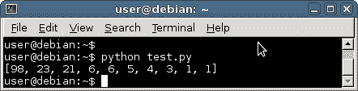

# 排序列表

> 原文： [https://pythonbasics.org/sort-list/](https://pythonbasics.org/sort-list/)

对列表进行排序非常简单：Python 内置了对列表进行排序的支持。

从一些数据开始：创建一个数字列表，然后调用`sort()`方法。 直接在列表对象上调用此方法。 这将适用于任何列表，包括成对列表。


## 排序示例

### 排序列表

我们用一串数字定义一个列表（`x`）。 然后在列表对象上调用`sort`方法。 我们不需要保存返回变量，只需调用该方法就足够了。

```py
x = [3,6,21,1,5,98,4,23,1,6]
x.sort()
print(x)

```

保存程序（`sort1.py`）并运行。 这将以从低到高的顺序输出所有数字。

您有字符串列表吗？ 字符串也可以排序。

```py
words = ["Be","Car","Always","Door","Eat" ]
words.sort()
print(words)

```

通过简单地调用`.sort()`方法，可以对包含多个项目的列表进行排序。

在执行此操作时，您不需要使用返回变量，因为列表是对象（有关 OOP 的更多信息，请参见 OOP 部分）。 现在，请记住您可以在列表上调用`.sort()`。

### 倒序

要以相反的顺序排序，请将其与方法`reverse()`组合

```py
x = [3,6,21,1,5,98,4,23,1,6]
x.sort()
x = list(reversed(x))
print(x)

```

所有数字将以相反的顺序显示。

那这是怎么回事？

首先，列表使用`x.sort()`排序。

然后将其提供给函数`reversed()`，该函数以列表作为参数。 但是，该函数不会返回列表对象，而是返回迭代器。 方法`list()`转换`reversed()`的输出，并将其转换为列表对象。



### 最佳反向排序方式

您可以使用更优雅的方式对列表进行排序：

```py
words = words[::-1]

```

这是什么骗术？

切片技术已在列表中使用。 这意味着切片列表，从第一个字符开始，最后一个字符结束，步长为 -1（反向）。

## 练习

1.  给定一个成对的列表，对第一个元素进行排序

    ```py
    x = [ (3,6),(4,7),(5,9),(8,4),(3,1)]

    ```

2.  现在排序第二个元素

[下载示例](https://gum.co/dcsp)