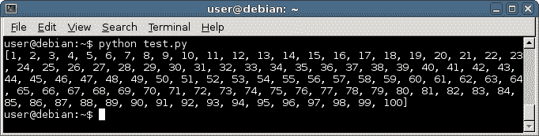

# `range`函数

> 原文： [https://pythonbasics.org/range-function/](https://pythonbasics.org/range-function/)

`range()`构造函数生成数字。 这在创建新列表或使用`for`循环时非常有用：它可以同时用于两者。

实际上，您很少自己定义列表，您可以从数据库，Web 或使用`range()`生成列表。


## 示例

假设您要创建一个包含 100 个数字的列表。 手工写出来非常耗时，而要使用`range`函数：

```py
x = list(range(100))
print(x)

```

Python 从零开始计数。 现在，如果您想从 1 数到 100，该怎么办？

```py
x = list(range(1,101))
print(x)

```



第三个参数定义步长，默认情况下为步长。 范围可以在`for`循环中使用：

```py
for i in range(1,11):
   print(i)

```

## 练习

试试下面的练习

1.  创建一千个数字的列表
2.  从该列表中获取最大和最小的数字
3.  创建两个列表，一个偶数和奇数。

[下载示例](https://gum.co/dcsp)