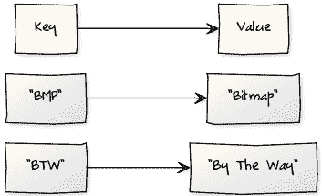

# 字典

> 原文： [https://pythonbasics.org/dictionary/](https://pythonbasics.org/dictionary/)

Python 字典是另一个集合。 实词词典是理解它们的一个很好的类比：它们包含一个项目列表，每个项目都有一个键和一个值。

在传统字典中，关键是单词，值是其解释或描述。 在 Python 中，您可以执行类似的操作。


## 示例

### 简介

用更严格的说法（数学上），字典是一对一的映射。 字典中的每个键都有一个值。 此值已分配给密钥。

**字典**：一组包含（键，值）对的集合



对于字典中的每个键，都有一个值。 与列表不同，字典没有特定的顺序。

这意味着如果您要定义一个字典并在其上循环，则每次输出都可能不同，因为 Python 忽略了顺序。

### 定义

让我们输入一些代码！ 您可以使用一个衬纸创建字典。 使用这些括号`{}`定义字典。

```py
words = {}

```

当心：这只是一个与列表不同的两个字符。 在此处输入错误，会将其与列表混在一起。

然后，您可以创建一个映射。 映射定义为键值对。 首先定义键，然后定义值：

```py
words[key] = value

```

您可以将字符串用作键。 一个关键的定义可以是：`words["PRONTO"]`

### 字典示例

在下面的示例中，我们定义了一些键，值对，然后使用其唯一键打印它们。键入以下代码，保存并运行：

```py
#!/usr/bin/python

words = {}
words["BMP"] = "Bitmap"
words["BTW"] = "By The Way"
words["BRB"] = "Be Right Back"

print words["BMP"]
print words["BRB"]

```

## 练习

1.  绘制国家到国家的短代码
2.  打印每个项目（键和值）

[下载示例](https://gum.co/dcsp)