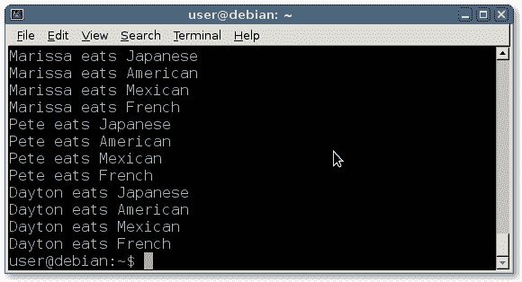

# 嵌套循环

> 原文： [https://pythonbasics.org/nested-loops/](https://pythonbasics.org/nested-loops/)

一个循环可以包含一个或多个其他循环：您可以在一个循环内创建一个循环。此原理称为嵌套循环。 嵌套循环遍历两个或多个循环。

程序员通常嵌套 2 或 3 层深度。 高于此的数字只会造成混乱。


## 示例

让我们做一个简单的例子。 我们创建两个列表：

```py
persons = [ "John", "Marissa", "Pete", "Dayton" ]
restaurants = [ "Japanese", "American", "Mexican", "French" ]

```

如果我们有一个喜欢在餐厅吃饭的人的列表，我们可以让他们每个人都在某个餐厅吃饭吗？

```py
#!/usr/bin/python

persons = [ "John", "Marissa", "Pete", "Dayton" ]
restaurants = [ "Japanese", "American", "Mexican", "French" ]

for person in persons:
    for restaurant in restaurants:
        print(person + " eats " + restaurant)

```

这遍历了两个循环：



## 练习

试试下面的练习

1.  给定一个 3x3 的井字游戏板，请打印每个位置

2.  创建一个程序，让每个人都与其他人见面

    `persons = [ “John”, “Marissa”, “Pete”, “Dayton” ]`

3.  如果正常的`for`循环在 n 步`O(n)`中完成，则嵌套循环有多少步？

完成这些步骤后，继续下一个练习。

[下载示例](https://gum.co/dcsp)