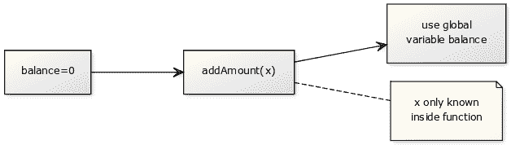

# 作用域

> 原文： [https://pythonbasics.org/scope/](https://pythonbasics.org/scope/)

变量在程序中具有一定的作用。 全局变量可以在程序中的任何位置使用，但是局部变量仅在特定区域（函数，循环）中已知

有时在项目中使用“作用域”一词：“其不在项目作用域之内”，表示不包括在内。 同样，变量可以在函数作用域之外。


## 示例：

### 简介

作用域与可以使用变量的位置有关。 如果定义了变量，则不一定在代码中的任何地方都可用。 函数中定义的变量只有在函数中才知道，除非您将其返回。

```py
def something():
   localVar = 1

# this will crash because localVar is a local variable
print(localVar)

```

这意味着除非您从函数返回变量，否则只能在其中使用它们。 这与全局变量形成了鲜明的对比：全局变量可以在任何地方使用，包括在多个函数和主代码中。 全局变量通常在程序顶部定义。

### 全局变量和局部变量

在下面的程序中，`balance`是一个全局变量。 它可以在代码中的任何地方使用。 但是变量`x`只能在`addAmount`内部使用。

```py
#!/usr/bin/env python3

balance = 0

def addAmount(x):
    global balance
    balance = balance + x

addAmount(5)
print(balance)

```

在视觉上是：



我们有两个变量：`balance`，一个可以在任何地方使用的全局变量。`x`，只能在函数内部使用（在局部作用域之外未知）。

## 练习

请尝试以下练习：

1.  添加函数`subAmount`以更改变量余额
2.  创建带有局部变量的函数

[下载示例](https://gum.co/dcsp)