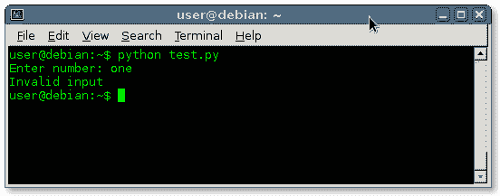

# `try except`

> 原文： [https://pythonbasics.org/try-except/](https://pythonbasics.org/try-except/)

`try except`语句可以处理异常。 当您运行程序时，可能会发生异常。

异常是在程序执行期间发生的错误。 Python 不会告诉您诸如语法错误（语法错误）之类的错误，而是会突然停止。

突然退出对最终用户和开发人员都是不利的。

除了紧急停止，您可以使用`try except`语句正确处理问题。 如果您没有正确处理异常，将会紧急停止。


## 示例

让我们采用这种情况：程序要求输入数字用户。 而是用户在输入框中键入字符。 该程序通常会崩溃。

### `try except`

`try except`语句可防止程序崩溃并对其进行正确处理。

```py
try:
    x = input("Enter number: ")
    x = x + 1
    print(x)
except:
    print("Invalid input")

```

输入无效的输入，使程序正常运行：



### `finally`

可以使用`finally`关键字扩展`try except`语句，如果不引发异常，则将执行此语句：

```py
finally:
    print("Valid input.")

```

如果没有引发异常，程序将继续执行。

有不同种类的异常：`ZeroDivisionError`，`NameError`，`TypeError`等。 有时，模块定义自己的异常。

### 练习

1.  可以使用`try-except`来捕获无效的键盘输入吗？
2.  如果无法打开文件，`try-except`能否捕获错误？
3.  什么时候不使用`try-except`？

[下载示例](https://gum.co/dcsp)