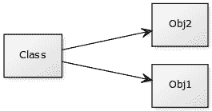

# 类

> 原文： [https://pythonbasics.org/class/](https://pythonbasics.org/class/)

Python 类是“面向对象编程”的概念。 Python 是一种面向对象的编程语言（OOP）。 OOP 是一种构建软件的方法。

使用 OOP，您可以使程序更有条理，可伸缩性，可重用性和可扩展性。 OOP 概念可能有点奇怪。 掌握起来可能很困难，但这是一个非常强大的概念。


## 示例

### 对象

在 Python 中，您可以定义对象。 对象是方法和变量的集合。 对象驻留在计算机内存中的某个位置。 它们可以在运行时进行操作。

让我们创建一个理论示例，我们创建一个对象狗。 创建对象只是一行代码：

```py
obj1 = dog()

```

每个对象可以具有变量。 这些变量的值对于对象是唯一的。 我们设置对象变量（名称，年龄）

```py
obj1.name = "Woof"
obj1.age = 5

```

如果对象存在方法，则可以调用它们。 对象的唯一变量可以在这些方法中使用。这些方法可以多次使用：

```py
obj1.bark()
obj1.bark()

```

在您的程序中，您可以有多个对象。 这些对象可以是相同类型或不同类型。

```py
obj1 = dog()
obj2 = dog()
obj3 = dog()
obj4 = bird()

```

那么 Python 如何知道对象的类型呢？ 如何知道某个类型存在哪些方法和变量？ 它们在一个类中定义。

### 类

对象总是从类创建的。 一个类定义对象中存在的每个方法和变量。 您可以将类视为对象的蓝图。

还记得前面的示例中的`dog`类型的对象吗？

该对象具有**变量**（`name`，`age`）和**方法**（`bark`）。 它们在狗类中定义。这是该类的定义方式：

```py
class dog:
    name = ""
    age = 0

    def bark(self):
        print('Bark')	    

```

首先，我们定义类本身：`class dog`。 然后定义变量（`name`，`age`）。 最后，我们定义方法。 如果仔细观察，就会发现该方法中包含`self`一词。`self`一词指的是对象（您可以从一个类中创建多个对象。）



### 详细示例

类不仅用于有趣的示例（狗，鸟）。 它们已在所有计算机软件中使用。

如果您承担制作网络浏览器的任务，则需要在某个时候显示一个网站。可以说程序将是面向对象的。 然后可以用这种方式定义一个类：

```py
#!/usr/bin/python
class Website:
    def __init__(self,title):
        self.title = title

    def showTitle(self):
        print(self.title)

```

等等..什么是`__init__`？

如果创建了对象，则调用方法`__init__`。 这始终是创建新对象时调用的第一个方法。 该方法称为**构造函数**。

然后，您可以创建 Web 浏览器对象。

```py
#!/usr/bin/python
class Website:
    def __init__(self,title):
        self.title = title

    def showTitle(self):
        print(self.title)

obj = Website('pythonbasics.org')
obj.showTitle()

```

在本示例中，我们有一个从类`Website`创建的对象（`obj`）。 该类有两种方法：`__init__`和`showTitle()`。

## 练习

试试下面的练习

1.  文件中可以有多个类吗？
2.  可以从同一个类中创建多个对象吗？
3.  对象可以创建类吗？
4.  使用上面的代码，创建另一个对象
5.  在类中添加一个方法：`location()`

完成这些步骤后，继续下一个练习。

[下载答案](https://gum.co/HhgpI)