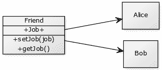

# 吸气剂和二传手

> 原文： [https://pythonbasics.org/getter-and-setter/](https://pythonbasics.org/getter-and-setter/)

一类可以再有一个变量（有时称为属性）。 创建对象时，这些对象中的每个对象对于这些变量都有唯一的值。

类变量不需要直接设置：可以使用类方法进行设置。 这是面向对象的方式，可帮助您避免错误。

**相关课程：** [完整的 Python 编程课程&练习](https://gum.co/dcsp)

## 范例

我们创建一个带有属性的类。 从该类中，我们创建几个对象。

```
class Friend:    
    def __init__(self):
        self.job = "None"

Alice = Friend()
Bob = Friend()

```

这些对象没有设置属性（作业）。 要进行设置，我们可以直接进行设置，但这是一个不好的做法。 相反，我们创建两个方法：getJob（）和 setJob（）。

```
class Friend:
    def __init__(self):
        self.job = "None"

    def getJob(self):
        return self.job

    def setJob(self, job):
        self.job = job

Alice = Friend()
Bob = Friend()

Alice.setJob("Carpenter")
Bob.setJob("Builder")

print(Bob.job)
print(Alice.job)

```

创建了两个对象，这两个对象对于属性作业均具有唯一的值：


## 练习

试试下面的练习

1.  添加可变年龄并创建吸气剂和吸气剂
2.  为什么要使用 getter 和 setter 方法？

完成这些步骤后，继续下一个练习。

[下载答案](https://gum.co/HhgpI)