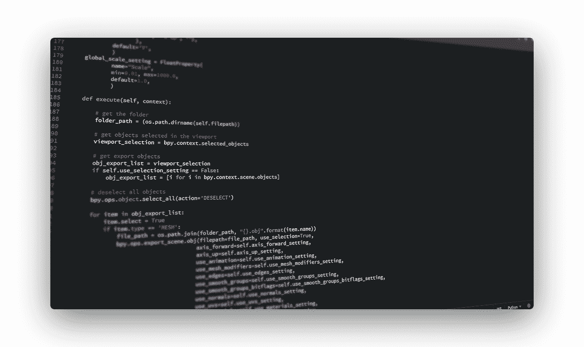

# 为什么 Python 很棒

> 原文： [https://pythonbasics.org/why-python-is-awesome/](https://pythonbasics.org/why-python-is-awesome/)

Python 由 Guido van Rossum 创建并于 1991 年发布，现在是一种高级的通用编程语言。

它旨在通过利用大量的空白和简单性来强调代码的可读性，因为与 C++ 或 Java 之类的其他语言相比，它允许程序员使用更少的代码行来编写模型和概念。

这使 python 成为一种非常流行的编程语言，用于桌面独立应用程序或在线/ Web 应用程序以及小型或大型开发项目。

## 为什么使用 Python？

### Python 可以用来做什么？

在最近几年中，随着 Web 应用程序开发过程的急剧发展，这就是使 Python 成为软件开发人员中领先的竞争者或选择的原因。 它几乎可以构建任何东西。

作为一种通用语言，Python 是开发几乎任何东西都可能需要的单一语言。

它可用于与用户进行交互的前端（客户端）和网站的后端（服务器端）数据库的编程。 它可以用于科学研究和研究的数值和数据分析。 它可以用于开发人工智能。 它可用于通过生产力工具，游戏和您可以考虑的其他类型的应用程序开发在线和离线应用程序。

简而言之，Python 是编程语言的万事通。 掌握它可能会使软件开发人员成为所有类型编程的专家。 它既有趣又易于使用。

### 初学者友好

Python 的主要设计宗旨是易于理解和愉快使用。 它的名字来自有趣的英国超现实喜剧团 Monty Python。

它具有许多可供参考的初学者教程，其令人愉悦的特性使其受到越来越多的人欢迎。

Python 使新手程序员能够迅速构建原型和工具，从而使他们立即感到满意。 由于易于使用，该语言正迅速成为初学者的入门语言。 很容易理解。

尽管 Python 是一种高级语言，但由于它易于理解，因此它是一种初学者友好的语言。 它不会给难以理解的机器等语言的人带来压力。 取而代之的是，它通过处理详细而又繁琐的语法和命令来像英语一样读起来，这使编程不那么吸引人。

您可以更深入地掌握编程的概念，而不会陷入学习语言的困境。 您会得到社区的支持。 如果您开始编程，那么您将不可避免地成为程序员社区的一部分，您将在编程项目中遇到的任何问题或疑虑都可以咨询并获得帮助。

### 社区

Python 社区是 stackoverflow，拥有大量聚会活动的最大社区之一，在那里，您不仅获得成功的支持，而且最重要的是，您还获得了终生可以拥有的朋友。 它提供了前景广阔的职业机会 Python 属于全球排名前五位的最受欢迎的编程语言，也是收入最高的编程语言。

### 职业

从事 python 的职业可以确保您在编程领域拥有巨大的就业机会和可赚钱的职业。 而且，由于该语言是灵活的，因此它还为您提供了要追求的编程领域的灵活性。 这些反映在越来越多的对学习 Python 感兴趣的人中。