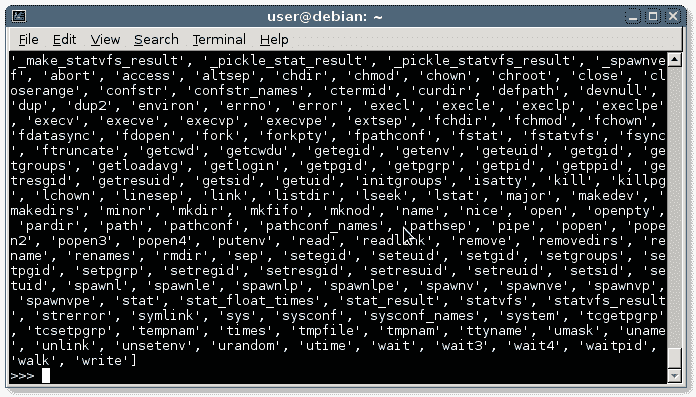

# 模块

> 原文： [https://pythonbasics.org/modules/](https://pythonbasics.org/modules/)

模块可以具有一个或多个函数。 他们可以帮助您组织代码。 您可以有多个文件（模块），而不是一个长的 Python 文件。

模块是具有函数或类的 Python 文件。 Python 程序可以使用一个或多个模块。


## 示例

### 什么是模块？

有许多可用于 Python 的模块（有时称为库）。 通过使用这些模块，您可以更快地进行编码。

将它们视为构建基块，它们包含大量为您提供其他函数的函数（有时是类）。

### 导入模块

您可以使用`import`关键字加载模块。

在下面的示例中，我们加载`os`模块。 这是操作系统的缩写，因此您可以执行系统任务。

```py
import os
os.system("dir")

```

使用该模块，我们调用其名为系统的函数之一（运行命令）。

在这种情况下，它将仅列出目录中的文件（`dir`命令）。

Python 有许多可用的模块。

### 从模块获取特定函数

要在模块中导入特定函数，可以使用以下行：

```py
from module import function

```

有一个名为`time`的模块，该模块具有各种时间函数：获取日期，小时，分钟，秒等。 有很多函数。

假设您希望程序等待 2 秒。 如果需要，可以导入特定函数而不是整个模块。

```py
#!/usr/bin/python
from time import sleep
sleep(2)

```

### 从模块导入所有函数

您可以从模块导入所有函数，但是不建议这样做。下面的示例导入整个时间模块（所有函数），然后可以使用。

```py
#!/usr/bin/python
from time
time.sleep(2)

```

### 列出模块中的函数

要查看模块中的所有函数，请启动 Python 解释器并输入

```py
python
import os
dir(os)

```

这将显示模块中的所有函数和类：



### 制作模块

要制作模块，请创建一个 Python 文件。 然后像导入其他模块一样将其导入。创建您的模块（`fruit.py`）

```py
def lemon():
    print('Lemonade')

```

然后创建您的程序（`example.py`）并调用该函数：

```py
import fruit

fruit.lemon()

```

### 找不到 python 模块

如果收到错误“`ImportError`：没有名为`<name>`的模块”，则表示未安装该模块。您可以使用`pip`软件包管理器安装模块。 为此，最好也设置一个`virtualenv`。

```py
virtualenv projectname
cd projectname
source bin/activate
pip install module

```

## 练习

试试下面的练习

1.  导入数学模块并调用`sin`函数
2.  使用函数`snake()`创建自己的模块

[下载示例](https://gum.co/HhgpI)