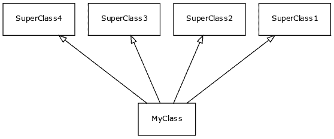

# 多重继承

> 原文： [https://pythonbasics.org/multiple-inheritance/](https://pythonbasics.org/multiple-inheritance/)

一个类可以从多个超类继承。 多重继承是标准或单一继承的扩展。 原理保持不变：一个类从另一个类继承。

多重继承是从更多父类继承的想法。 一个类可以继承 2,3 或多个类。


## 示例

### 简介

一个类可以从 Python 中的多个类继承（其他编程语言并非总是如此）。如果创建一个类，则可以让它从父类（有时称为超类）继承。

该类本身可以命名为子类，因为它有多个父类。

如果一个类继承自超类，它将获得其所有属性和方法。 如果您有 4 个超类，它将仅继承所有它们。

通用格式为：

```py
class Subclass(SuperClass1, SuperClass2, SuperClass3, ..):

```

您可以直观地看到：



### 多重继承

在下面的程序中，定义了两个超类：`Human`和`Coder`。 通过使用以下代码行，`Pythonista`类从这两个类继承：

```py
class Pythonista(Human, Coder):

```

该程序通过创建一个对象继续进行。 该对象具有来自所有 3 个类的属性：超类及其本身。 如果在超类或类中定义方法，则对象将具有所有方法。

```py
class Human:
    name = ""

class Coder:
    skills = 3

class Pythonista(Human, Coder):
    version = 3

obj = Pythonista()
obj.name = "Alice"

print(obj.name)
print(obj.version)
print(obj.skills)

```

### 批评

多重继承的批评者指出，它增加了复杂性，并使代码难以重用。 在这一点上，如果要将一个类复制到新程序，则也必须复制所有超类。

对于一个类来说，这可能很好，但是如果您的代码到处都有多重继承，则很难将部件用作其他程序的可重用组件。

实际上，向程序添加多个继承会在类之间创建强大的内聚力。 但这并不意味着它不是有用的工具。

## 练习

试试这些练习：

*   所有编程语言都支持多重继承吗？
*   为什么不使用多重继承？
*   可以继承的类的数量是否有限制？

在上面的练习部分中下载答案。

[下载示例](https://gum.co/HhgpI)